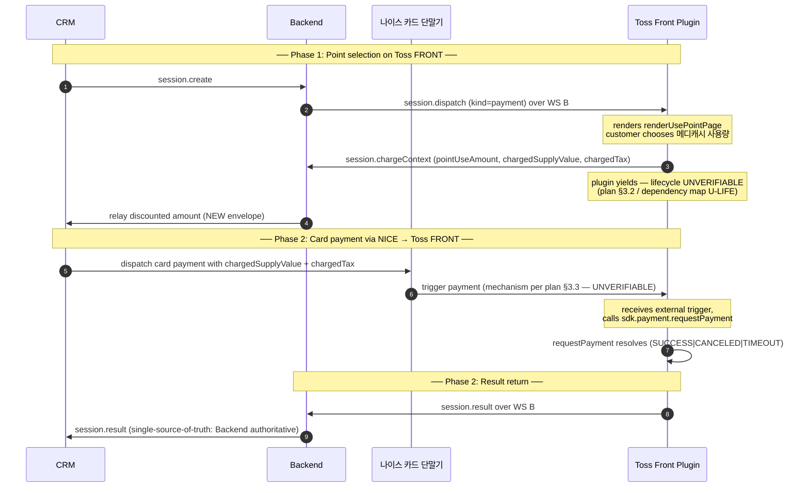

# Payment Flow with NICE Terminal — Backend Role

> **Source of truth:** [docs/payment-flow-with-nice-terminal.md](./payment-flow-with-nice-terminal.md)
>
> This document describes Backend responsibilities under the proposed four-party flow at the **conceptual level only**. It does NOT prescribe endpoints, transport choices, message schemas, persistence shapes, or DB columns — those decisions belong to the backend engineer. What this document fixes is the **flow, the state semantics, and the constraints** the backend implementation must satisfy.
>
> **Audience:** backend engineer designing/extending the Backend (Core).
> **Scope:** backend-only. Frontend and CRM roles live in [frontend](./payment-flow-with-nice-terminal-frontend.md) and [crm](./payment-flow-with-nice-terminal-crm.md) sibling docs.
> **Compiled:** 2026-05-08.

---

## 1. Main flow (shared across all three role docs)



---

## 2. Backend's role in the new flow

Backend remains the **orchestrator and single source of truth for session state**. The four-party flow does NOT change Backend's authority — it adds a phase-1→2 hand-off with new contract surface to CRM, and accommodates a longer wait window.

The conceptual responsibilities, in roughly the order they fire:

1. **Session creation.** Accept `session.create` from CRM; persist with the same identity / 메디캐시 / hospital-context lookups Backend does today.
2. **Phase-1 dispatch to plugin.** Send `session.dispatch (kind=payment)` over WS B, same as today.
3. **Receive `session.chargeContext` from plugin.** Validate and persist the post-점-사용 amounts.
4. **NEW — Forward discounted amounts to CRM.** Backend must inform CRM of the post-점-사용 `chargedSupplyValue` + `chargedTax` so CRM can dispatch to NICE with the discounted amount. The exact envelope is a backend-design choice (see §5 constraints).
5. **Hold the wait window.** Track that the session is in a phase-1-complete-awaiting-phase-2 state; admit the longer wait timer (see §3 state semantics).
6. **Receive `session.result` from plugin.** Same shape as today; Backend persists, transitions session to terminal state.
7. **Notify CRM of terminal state.** Same shape as today's `session.result` envelope to CRM.
8. **Refund flow.** Unchanged from today (`refund.create` from CRM → `session.dispatch (kind=cancel)` to plugin → `refund.result` from plugin → notify CRM).
9. **Recovery, error frames, abort.** Conceptually the same as today, with extensions for the new wait window (see §3).

---

## 3. State semantics

The current backend state machine is:

```
CREATED → DISPATCHED → IN_PROGRESS → SUCCEEDED | FAILED | CANCELED | TIMEOUT | EXPIRED
```

(See [docs/superpowers/specs/toss-payment-flow.md §State Summary](./superpowers/specs/toss-payment-flow.md).)

The proposed four-party flow introduces a new conceptual sub-state between "post-`session.chargeContext`" and "phase-2 `requestPayment` actually starts." Backend must represent this somehow. Two acceptable shapes; the backend dev picks:

**Option A — Add an explicit sub-state** (plan Alternative F):
```
CREATED → DISPATCHED → IN_PROGRESS_POINTS → AWAITING_NICE → IN_PROGRESS_CARD → terminal
```
- `AWAITING_NICE` has a longer timer (e.g., 5 minutes) and is **abortable** by CRM.
- `IN_PROGRESS_CARD` resumes the existing `IN_PROGRESS` semantics (timeoutMs + 30s grace).

**Option B — Two coupled sessions** (plan Alternative G):
- Phase 1 ends with the original sessionId in a "POINT_PHASE_DONE" terminal-ish state.
- Phase 2 starts a new sessionId that references the parent.
- Refund logic must coalesce two sessions when constructing `cancelParams`.

Either option is acceptable; **what is NOT acceptable** is keeping the current single `IN_PROGRESS` state with no extension — its `timeoutMs + 30s` window (currently ~90s) cannot accommodate an arbitrary phase-1→2 customer wait.

---

## 4. Constraints the implementation must satisfy

These are the invariants the plan locks in — backend dev decides HOW, but cannot violate WHAT:

### 4.1 Single source of truth for result

Per plan §3.4, Backend's `session.result` write must be **authoritative**. Even if NICE separately reports the card transaction outcome to CRM, the system's record of truth comes from the plugin's `session.result` reaching Backend. CRM should NOT independently mark a session SUCCEEDED based on NICE's word alone.

### 4.2 100%-메디캐시 bypass signal

Per plan §4.5, when `pointUseAmount === treatmentTotal` and `chargedSupplyValue === 0`, Backend must signal CRM to **skip dispatching to NICE** for that session. The plugin's existing skip path (sends `session.result` with `tossResponse: null` directly) handles the SDK side; Backend must propagate this to CRM in time for CRM not to call NICE.

### 4.3 Phase-1→2 wait timer

Per plan §4.3, the wait window between `session.chargeContext` and the eventual `session.result` may legitimately exceed the current 90-second `IN_PROGRESS` bound. Backend's timer policy must permit a longer wait for whichever sub-state represents this window. **Concrete number:** TBD by backend dev, but should accommodate normal customer behavior at a 카드 단말기 (multiple minutes).

### 4.4 Abortability during the wait

Per plan §4.4, the new wait window should remain **abortable** by CRM (current state machine rejects abort once `IN_PROGRESS`). When CRM aborts during the wait, Backend must:
- Send `session.abort` over WS B so the plugin can render a terminal screen / `setIdle`.
- Notify CRM of the terminal `CANCELED` state.
- (If applicable) tell CRM to inform NICE not to expect a payment trigger — depends on whether CRM has already dispatched to NICE.

### 4.5 Recovery semantics unchanged

Per plan §4.2, `session.reconcile` and the plugin's pendingPayment recovery work as today, **as long as Toss FRONT itself called `requestPayment`** (the canonical model). Backend's job: keep sending `session.reconcile` after EXPIRED suspect; persist whatever the plugin returns.

### 4.6 Refund unchanged

Per plan §4.1, `refund.create` from CRM continues to construct `cancelParams` from the persisted `tossResponse` and dispatch `session.dispatch (kind=cancel)` over WS B. No changes from today's contract.

### 4.7 Error frame propagation

Per current spec ([toss-payment-flow.md §11](./superpowers/specs/toss-payment-flow.md)), Backend uses graceful `error` frames instead of WS 1011 closes. This stays. The new wait window is also subject to error-frame propagation — anything that goes wrong (Hospital DB write fails, upstream Feign error, etc.) must surface to plugin AND CRM as `error` frames carrying the affected `sessionId`.

### 4.8 Idempotency

Currently `[GAP]` for plugin SDK ([2026-04-27-frontend-plugin.md §2.10](./superpowers/specs/2026-04-27-frontend-plugin.md)). The new flow does NOT add new idempotency requirements at the plugin SDK level. At the **Backend↔CRM** envelope level, the new "discounted amount" message and any `session.proceed` / `session.abort` should follow whatever idempotency convention Backend already uses on existing envelopes (`session.create` → `session.ack` carries `clientRequestId`).

---

## 5. What's left to backend dev to decide

Anything below this line is **explicitly under-specified** — pick what fits the existing Backend codebase:

- The exact transport / envelope name for the new "discounted amount → CRM" message. Reasonable candidates: extend `session.status` with the post-점-사용 amounts; introduce a new `session.proceed` envelope. Pick one consistent with existing `session.*` naming.
- Whether to use Option A (add `AWAITING_NICE`) or Option B (two coupled sessions) for the phase-1→2 representation. Option A is closer to current state machine and is the recommended starting point unless refund coalescing in Option B turns out simpler than expected.
- The concrete wait-window timer value.
- Whether `session.dispatch` retains its phase-2 trigger role as a fallback (e.g., when NICE→Toss `sdk.webSocket` integration is unverified, Backend may still want a way to dispatch to plugin directly). The plugin does not need to know which path is active; Backend chooses.
- Hospital DB schema additions (new state column, parent-child columns for Option B, etc.).
- CRM-facing error code for the new abort-during-wait case if you decide to distinguish it from existing `IN_PROGRESS_NOT_ABORTABLE`.
- Whether to expose any new HTTP endpoint or rely entirely on WS A for the new CRM-facing envelopes.
- Any additions to the WS B authentication / token flow ([config.js:9–14](../front-plugin-js/config.js) currently ships a dev-only token; production token sourcing was already an open question pre-NICE).

---

## 6. Open questions affecting backend specifically

From plan §6 — items with backend impact:

| # | Plan ref | Question | Why it matters to backend |
|---|---|---|---|
| 1 | §6.4 #13 | Phase-1→2 session timer policy | Backend timer extension or Option A/B choice |
| 2 | §6.4 #14 | New `session.proceed` (or equivalent) envelope to CRM | Backend defines and ships it |
| 3 | §6.4 #15 | Skip-path bypass signal for 100%-메디캐시 | Backend defines and ships it |
| 4 | §6.4 #16 | Result-routing single-source-of-truth | Backend's authoritative role with respect to NICE-side result claims |
| 5 | §6.1 #1, #2 | `sdk.webSocket` foreground/idle behavior | Affects whether Backend needs a fallback `session.dispatch` for phase-2 trigger |
| 6 | §6.3 #11 | NICE behavior on zero-amount transactions | If Alternative I is taken (always route through NICE), Backend still emits the bypass — but CRM/NICE-side coordination shifts |

---

## 7. What stays the same vs. today

These existing Backend behaviors and contracts are **unaffected** by the new flow:

- WS A and WS B endpoints, registration, heartbeat policy.
- `device.register` ack semantics.
- `session.create` → `session.ack` shape.
- `session.claim` → `IN_PROGRESS` transition (still applies to phase 1 of the new flow).
- `session.chargeContext` payload shape and validation rule (`pointUseAmount + chargedSupplyValue + chargedTax + tip == original total`).
- `session.result` payload shape, including `late: true` semantics for recovery.
- 100%-메디캐시 server-side handling (`tossResponse: null` accepted; `pointUseAmount === total → SUCCEEDED`).
- Hospital DB persistence model for `TOSS_PAYMENT_SESSION` and `RCPT_INFO.DC_AMT` updates.
- Refund flow end-to-end.
- Reconciliation flow (`session.reconcile`).
- Error frame codes (`INVALID_REQUEST` / `INVALID_STATE` / `UPSTREAM_ERROR` / `INTERNAL_ERROR`).
- Hospital ↔ Reservation Platform Feign integrations.

---

## 8. Hand-off to backend engineer

Suggested ordering of backend work, gated by plan §6.1 outcomes:

1. **Pre-test block** (no Toss SDK uncertainty):
   - Define and ship the "discounted amount → CRM" envelope (Constraint 4.1, decision §5)
   - Define and ship the 100%-메디캐시 bypass signal (Constraint 4.2)
   - Decide Option A vs. Option B and ship the new state-machine sub-state with its timer (Constraints 4.3, 4.4)
2. **Post-test block** (after §6.1 / §6.3 resolutions):
   - Decide whether `session.dispatch` retains a phase-2 fallback role (decision §5)
   - Update [toss-payment-flow.md](./superpowers/specs/toss-payment-flow.md) to reflect the new contract
3. **Polish:**
   - Update CRM-side spec(s) for the new envelopes
   - Coordinate with plugin team on the moved `session.chargeContext` boundary

---

## 9. References

- **Source of truth (plan):** [docs/payment-flow-with-nice-terminal.md](./payment-flow-with-nice-terminal.md)
- **Companion role docs:**
  - [docs/payment-flow-with-nice-terminal-frontend.md](./payment-flow-with-nice-terminal-frontend.md)
  - [docs/payment-flow-with-nice-terminal-crm.md](./payment-flow-with-nice-terminal-crm.md)
- **Current canonical Backend ↔ Plugin protocol:**
  - [docs/superpowers/specs/toss-payment-flow.md](./superpowers/specs/toss-payment-flow.md)
- **Verified Toss SDK reference (read-only for backend, but useful for understanding what plugin will actually do):**
  - [docs/superpowers/specs/2026-04-27-frontend-plugin.md](./superpowers/specs/2026-04-27-frontend-plugin.md)
