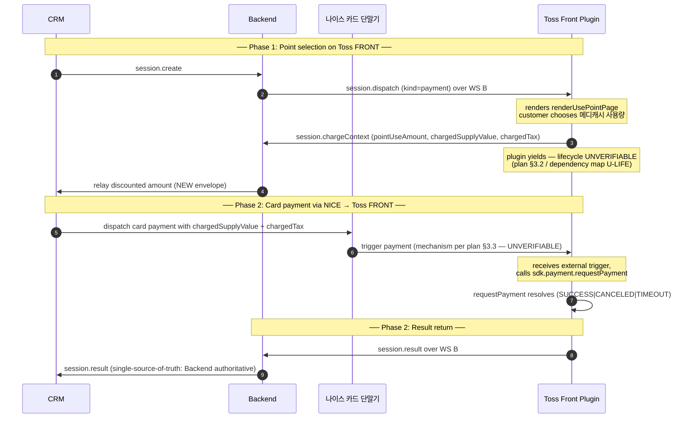

# Payment Flow with NICE Terminal — CRM Role

> **Source of truth:** [docs/payment-flow-with-nice-terminal.md](./payment-flow-with-nice-terminal.md)
>
> This document describes CRM responsibilities under the proposed four-party flow. CRM is the **legacy hospital management application** that initiates payment sessions and ultimately records the outcome. Specifics of CRM's internal implementation are left to the CRM team; this doc fixes only the role and the contract surface CRM exposes / consumes.
>
> **Audience:** CRM engineer integrating the new payment flow.
> **Scope:** CRM-only. Frontend and Backend roles live in [frontend](./payment-flow-with-nice-terminal-frontend.md) and [backend](./payment-flow-with-nice-terminal-backend.md) sibling docs.
> **Compiled:** 2026-05-08.

---

## 1. Main flow (shared across all three role docs)

---

## 2. CRM's role in the new flow

CRM's role expands compared to today: previously CRM only **initiated** the session and **observed** the result. Under the proposed flow, CRM also **dispatches the card transaction to NICE** between phase 1 and phase 2.

The conceptual responsibilities, in order:

1. **Initiate session.** Send `session.create` to Backend over WS A (or HTTP equivalent), same as today. Carry: `clientRequestId`, `deviceSerialNumber`, `workstationId`, `crmOrigin`, `amount`, `pointAccrualTargetAmount`, `orderSnapshot`. Optionally `pointContext` if CRM has it locally; otherwise Backend looks it up.
2. **Receive `session.ack`.** Capture `sessionId`. Same as today.
3. **Wait through phase 1.** During phase 1 (plugin renders `renderUsePointPage`, user chooses point use), CRM is passive. Backend may push `session.status` updates (`DISPATCHED`, `IN_PROGRESS`, possibly a new `AWAITING_NICE` per backend's choice — see [backend role doc §3](./payment-flow-with-nice-terminal-backend.md)).
4. **NEW — Receive discounted-amount envelope from Backend.** When Backend has the post-점-사용 amounts, it forwards them to CRM. The exact envelope name and shape is a backend decision (see [backend §5](./payment-flow-with-nice-terminal-backend.md)); CRM consumes whatever Backend ships.
5. **NEW — Dispatch to NICE 카드 단말기 with the discounted amounts.** This is the new responsibility introduced by the four-party flow. CRM tells NICE to begin a card transaction for `chargedSupplyValue + chargedTax` (the post-점-사용 amount). The CRM↔NICE protocol is owned by the CRM/NICE integration; this doc does not specify it.
6. **NEW — Skip step 5 when 100%-메디캐시.** When Backend signals that `pointUseAmount === treatmentTotal` (i.e., the entire treatment is covered by 메디캐시 and `chargedSupplyValue === 0`), CRM **must NOT dispatch to NICE**. The plugin handles the skip path internally and Backend will deliver `session.result` (with `tossResponse: null` and `status: SUCCEEDED`) directly. See plan §4.5.
7. **Receive terminal `session.result` from Backend.** Backend is the single source of truth for the outcome (plan §3.4). Whatever NICE separately tells CRM about the card transaction is **observational only**; CRM's authoritative record-keeping should follow Backend's `session.result`.
8. **Refund.** When refund is needed, CRM sends `refund.create` to Backend, same as today. The refund flow is unaffected by NICE's involvement (plan §4.1) — Backend dispatches `session.dispatch (kind=cancel)` to plugin, plugin runs `requestPaymentCancel`, result comes back via `refund.result`.

---

## 3. What's new for CRM

### 3.1 Receive discounted-amount envelope from Backend

Today's CRM consumes `session.status` and `session.result` from Backend. The new flow adds **one more inbound envelope** at the phase-1→2 boundary: an envelope carrying the post-점-사용 `chargedSupplyValue` + `chargedTax`. CRM uses these to dispatch the right amount to NICE.

**Envelope name:** TBD — backend dev's call (see [backend §5](./payment-flow-with-nice-terminal-backend.md)). CRM should treat this as a new contract item to coordinate on.

**Required fields (conceptual):**
- `sessionId`
- `pointUseAmount` (so CRM can decide skip-path)
- `chargedSupplyValue`
- `chargedTax`
- (Optionally) the original treatment amount for cross-checking

### 3.2 Dispatch to NICE

This is **new** relative to today's flow, where CRM passes everything to Backend and Backend dispatches to the plugin. Now CRM owns a new outbound integration: CRM → NICE.

The CRM↔NICE protocol is **out of scope of this document and the source-of-truth plan**. Plan §6.3 #10 lists this as an open question to take to NICE vendor docs / SMEs. CRM team needs to:
- Confirm what protocol NICE expects (HTTP? Serial? Proprietary?)
- Confirm what payload NICE consumes (amount, payment-key correlation, sessionId mapping?)
- Confirm what outcome NICE reports back to CRM (likely after the card transaction completes on the Toss device)

### 3.3 100%-메디캐시 skip

Today, when 메디캐시 fully covers the treatment, the plugin sends `session.result` directly to Backend without calling Toss SDK; Backend writes `SUCCEEDED` and notifies CRM. CRM's only job today is to consume the SUCCEEDED notification.

Under the new flow, **CRM must additionally know not to dispatch to NICE in this case**. The signal comes from Backend in the discounted-amount envelope (§3.1) — when `pointUseAmount` equals the original treatment total and `chargedSupplyValue` is zero, skip the NICE dispatch entirely.

**Practical rule for CRM:** if the discounted amount is zero, the plugin will handle this without NICE. Wait for Backend's `session.result` and act on that.

### 3.4 Abort during phase-1→2 wait

Today, CRM-driven abort is rejected once `IN_PROGRESS`. Under the new flow, the phase-1→2 wait window is a place where the customer might walk away or the operator might want to cancel — it should remain abortable.

The exact contract for "abort during the wait window" depends on backend's state-machine choice (see [backend §3](./payment-flow-with-nice-terminal-backend.md)). What CRM needs to know:
- Send the same `session.abort` envelope as today; backend determines acceptability.
- If CRM has already dispatched to NICE for phase 2, **CRM must also tell NICE to cancel** (so NICE doesn't proceed with the card transaction).
- If CRM has not yet dispatched to NICE (e.g., abort happens between receiving the discounted-amount envelope and CRM's NICE dispatch), no NICE-side action needed.

---

## 4. What stays the same for CRM

- `session.create` shape (incl. `clientRequestId` for idempotency).
- `session.ack` consumption.
- `session.status` transitions (`CREATED` → `DISPATCHED` → `IN_PROGRESS` → terminal).
- Terminal `session.result` envelope.
- `refund.create` and `refund.result` shapes.
- 100%-메디캐시 success notification (now delivered without NICE involvement; envelope itself unchanged).
- Hospital / customer / 메디캐시 lookup flows (Backend handles via Hospital + Reservation Platform Feign).
- The `crmOrigin` payload structure (`hospitalId`, `organizationId`, `customerNumber`, `insuranceSeqNo`, `clinicSeqNo`, `reservationSeqNo`).
- Workstation token authentication on WS A.

---

## 5. Open questions affecting CRM specifically

From plan §6 — items with CRM impact:

| # | Plan ref | Question | Why it matters to CRM |
|---|---|---|---|
| 1 | §6.3 #10 | NICE's protocol with Toss FRONT and CRM | CRM owns the new CRM→NICE integration |
| 2 | §6.3 #11 | NICE behavior on zero-amount transactions | If skip-path bypass for 100%-메디캐시 cannot be implemented cleanly on backend side, CRM may need to handle the skip itself |
| 3 | §6.3 #12 | NICE refund / void path | CRM owns the customer-facing refund UX — needs to know whether NICE-side action is needed in addition to Toss SDK refund |
| 4 | §6.4 #14 | New "discounted amount" envelope | CRM consumes whatever backend ships |
| 5 | §6.4 #15 | Skip-path bypass signal | Same — CRM consumes |
| 6 | §6.4 #16 | Result-routing single-source-of-truth | CRM must NOT mark a session SUCCEEDED based on NICE alone; wait for Backend |

---

## 6. Hand-off to CRM engineer

Suggested ordering of CRM work, gated by plan §6 outcomes and backend's contract decisions:

1. **Pre-NICE block:**
   - Coordinate with backend on the new "discounted amount" envelope shape (§3.1) and the skip-path bypass signal (§3.3).
   - Decide whether existing `session.abort` semantics suffice for the phase-1→2 wait window or whether a new sub-state is exposed (depends on backend's Option A vs. Option B choice).
2. **NICE integration block** (gated by plan §6.3 #10):
   - Build the CRM→NICE dispatch path with the discounted amounts (§3.2).
   - Build the abort-coordination path between CRM and NICE (§3.4).
   - Build the NICE→CRM result observation path (NICE will likely tell CRM the card transaction outcome; CRM should treat this as observational, with Backend's `session.result` as the authoritative record).
3. **Polish:**
   - Update CRM-side payment UI to reflect the new "waiting for NICE" intermediate state (the customer is at the Toss device for phase 1, then at the NICE 단말기 for phase 2 — make sure the operator UX is clear).
   - Coordinate with plugin team on the optional confirmation page (`renderOrderPage` may or may not show in phase 1 — UX decision).

---

## 7. References

- **Source of truth (plan):** [docs/payment-flow-with-nice-terminal.md](./payment-flow-with-nice-terminal.md)
- **Companion role docs:**
  - [docs/payment-flow-with-nice-terminal-frontend.md](./payment-flow-with-nice-terminal-frontend.md)
  - [docs/payment-flow-with-nice-terminal-backend.md](./payment-flow-with-nice-terminal-backend.md)
- **Current canonical Backend ↔ Plugin protocol** (for reference; `session.create` / `session.result` envelope shapes apply to CRM↔Backend):
  - [docs/superpowers/specs/toss-payment-flow.md](./superpowers/specs/toss-payment-flow.md)
