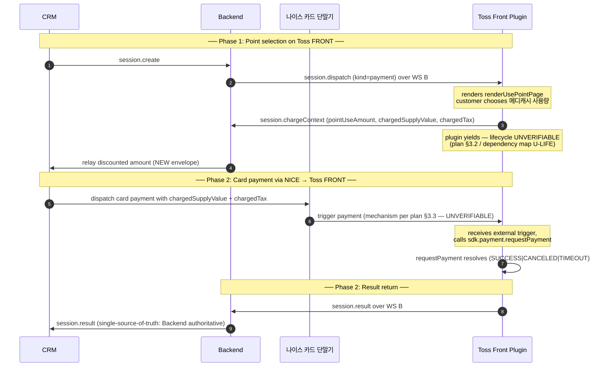

# Payment Flow with NICE Terminal — Frontend (Toss FRONT Plugin) Role

> **Source of truth:** [docs/payment-flow-with-nice-terminal.md](./payment-flow-with-nice-terminal.md)
>
> This document is a **role-specific extract** of the Gen-4-converged feasibility review. It describes Toss FRONT plugin responsibilities under the proposed four-party flow. It does **not** restate verdicts or alternatives — for those, read the source-of-truth plan.
>
> **Audience:** plugin engineer working in [`front-plugin-js/`](../front-plugin-js/).
> **Scope:** frontend-only. CRM and backend roles live in [crm](./payment-flow-with-nice-terminal-crm.md) and [backend](./payment-flow-with-nice-terminal-backend.md) sibling docs.
> **Compiled:** 2026-05-08.

---

## 1. Main flow (shared across all three role docs)



---

## 2. Plugin's responsibilities

### 2.1 Phase 1 — point selection (already implemented)

The plugin's phase-1 behavior is essentially the **existing flow** up to the point where today it would call `sdk.payment.requestPayment`. Concretely:

| Responsibility | Current code | Status |
|---|---|---|
| Idle screen + WS B dispatcher | [home.html:36–294](../front-plugin-js/home.html) | Unchanged |
| Receive `session.dispatch (kind=payment)` and route to order page | [home.html:144–164](../front-plugin-js/home.html) | Unchanged |
| Open WS B, send `session.claim` from order page | [order.html:74–94](../front-plugin-js/order.html) | Unchanged |
| Compute usable 메디캐시 (`floor(min(balance, treatmentTotal) / 100) * 100`) | [order.html:167–173](../front-plugin-js/order.html) | Unchanged |
| Render `renderUsePointPage` if `usableCash >= minUseAmount` | [order.html:294–324](../front-plugin-js/order.html) | Unchanged |
| Render `renderOrderPage` after point choice | [order.html:243–285](../front-plugin-js/order.html) | Unchanged (UX decision: keep or skip in new flow) |
| Send `session.chargeContext` with chosen amounts | [payment.html:126–134](../front-plugin-js/payment.html) | **Move:** sent at end of phase 1 (from order.html) instead of beginning of payment.html |

### 2.2 Phase 1 → Phase 2 transition — UNVERIFIABLE

This is the gating uncertainty for the entire flow (plan §3.2). The plugin must yield after `session.chargeContext` and resume when NICE triggers. Three concrete shapes the implementation could take:

- **Stay foreground** on a Template API "waiting" page (e.g., `renderResultPage` with extended `timerMs` if Toss permits, or a custom waiting template). The `sdk.webSocket` server starts during this wait. NICE connects; the plugin's `listen.message` handler invokes `sdk.payment.requestPayment`.
- **Return to idle** via `sdk.app.setIdle()`. NICE later triggers a re-mount via an undocumented mechanism (Android intent, VAN signal, or `sdk.webSocket` running on idle WebView). This path is **UNVERIFIABLE** until §6.1 real-device tests.
- **Two-stage sessions** (plan §5.4 Alternative G). Phase 1 ends with backend in a "point-phase complete" terminal state; phase 2 starts a new sessionId.

The plugin doesn't get to pick this alone — the choice depends on the §6.1 test outcomes and the team's commitment to a backend-state-machine extension. Plugin engineer should treat this as a **design decision delivered from above**, not a plugin-side judgment call.

### 2.3 Phase 2 — card payment (new wiring)

Once phase 2 is triggered (mechanism per plan §3.3), the plugin's responsibility is mostly the **existing payment path** with a different entry point:

| Responsibility | Current code | Status |
|---|---|---|
| Open WS B, send `device.register` | [payment.html:575–587](../front-plugin-js/payment.html) | Unchanged |
| Persist `pendingPayment` before `requestPayment` | [payment.html:197–206](../front-plugin-js/payment.html) | Unchanged |
| Call `sdk.payment.requestPayment` with `paymentKey`, `tax`, `supplyValue`, `tip`, `excludePaymentTypes: ['CASH']` | [payment.html:222–230](../front-plugin-js/payment.html) | Unchanged |
| Send `session.result` over WS B with full `tossResponse` | [payment.html:262–271](../front-plugin-js/payment.html) | Unchanged |
| Render terminal result page (`renderResultPage` success / `renderOrderResultPage` cancelled) | [payment.html:278–366](../front-plugin-js/payment.html) | Unchanged |
| **Listen for NICE-side trigger via `sdk.webSocket`** | NEW — does not exist today | **NEW** — see §3 below |

### 2.4 Phase 2 result return

The plugin's existing `session.result` send to Backend (over WS B) is the canonical path. The plan recommends Backend as single-source-of-truth (§3.4 of source-of-truth doc). Plugin **does not** also send to NICE unless the §3.4 routing decision changes.

| Responsibility | Current code | Status |
|---|---|---|
| `session.result` over WS B (live path) | [payment.html:262–271](../front-plugin-js/payment.html) | Unchanged |
| `session.result` over WS B with `late: true` (recovery path) | [home.html:204–219](../front-plugin-js/home.html), [config.js:75–88](../front-plugin-js/config.js) | Unchanged |
| Reply to NICE over `sdk.webSocket` (if §3.4 routing requires) | NEW — if needed | **Optional NEW** — only if the routing-decision changes |

### 2.5 Refund (`requestPaymentCancel`) — unchanged

| Responsibility | Current code | Status |
|---|---|---|
| Receive `session.dispatch (kind=cancel)` | [home.html:154–156](../front-plugin-js/home.html) | Unchanged |
| Call `sdk.payment.requestPaymentCancel(cancelParams)` | [payment.html:385–390](../front-plugin-js/payment.html) | Unchanged |
| Send `refund.result` over WS B | [payment.html:412–418](../front-plugin-js/payment.html) | Unchanged |

Refund is unaffected by NICE involvement **as long as Toss FRONT itself ran `requestPayment` in phase 2** (the canonical model, plan §4.1). If the team is forced down Alternative E (NICE owns card transaction), refund via Toss SDK becomes IMPOSSIBLE for those payments — the plan flags this; the plugin team should stop reading at that point and escalate.

### 2.6 Recovery — unchanged

| Responsibility | Current code | Status |
|---|---|---|
| Read `smartdoctor.pendingPayment` on every page load | [home.html:108–122](../front-plugin-js/home.html), [config.js:39–110](../front-plugin-js/config.js) | Unchanged |
| Resolve via `sdk.payment.getPayment({ paymentKey })` and post `session.result` with `late: true` | [config.js:71–89](../front-plugin-js/config.js) | Unchanged |
| Handle `session.reconcile` from Backend on reconnect | [home.html:166–231](../front-plugin-js/home.html) | Unchanged |

### 2.7 Timeout, abort, 100%-메디캐시 skip path

See plan §4.3 / §4.4 / §4.5 for the verdicts. From the plugin's perspective:

- **Timeout:** `sdk.payment.requestPayment` `timeoutMs` semantics unchanged.
- **`session.abort` (CRM-driven):** existing handlers in [home.html:233–240](../front-plugin-js/home.html), [order.html:121–130](../front-plugin-js/order.html) cover the DISPATCHED-state abort. Phase-1→2 wait-window abort behavior depends on backend state-machine extension — the plugin only acts when WS B delivers an abort frame.
- **`session.abort` (plugin-driven `USER_BACKED_OUT`):** existing handlers in [order.html:265–283, :308–323](../front-plugin-js/order.html) cover use-point and order pages. If a custom phase-1→2 waiting screen is added, it needs an analogous `onBack` → `session.abort` send.
- **100%-메디캐시 skip:** existing skip path at [payment.html:142–191](../front-plugin-js/payment.html) is unchanged at the SDK level. Plugin still sends `session.result` with `tossResponse: null` directly, **without involving NICE**. Backend must signal CRM accordingly so CRM does not dispatch to NICE in this case.

---

## 3. The single new piece of plugin code (conceptually)

The only structurally new plugin responsibility under the proposed flow is **hosting an `sdk.webSocket` server that listens for a NICE trigger and invokes `sdk.payment.requestPayment` on receipt**.

The exact wiring (which page hosts the server, what JSON schema NICE sends, how the `paymentKey` reaches the handler, how port discovery happens) is **NOT decidable until §6.1 real-device tests resolve**. Pseudo-code shape only:

```js
// Conceptual — actual wiring depends on plan §6.1 test outcomes
const server = await sdk.webSocket.start({
  port: <fixed port or 0>,
  onMessage: async ({ connectionId, data }) => {
    const msg = JSON.parse(data);
    if (msg.type === '<NICE-defined trigger type>') {
      const result = await sdk.payment.requestPayment({
        paymentKey: msg.paymentKey,
        supplyValue: msg.chargedSupplyValue,
        tax: msg.chargedTax,
        tip: 0,
        excludePaymentTypes: ['CASH'],
      });
      // result routing per plan §3.4
    }
  },
});
```

**Do not implement this until** the team has resolved at minimum:

- Plan §6.1 #1 (foreground/idle behavior of `sdk.webSocket` server)
- Plan §6.1 #2 (external-wake from idle, if needed)
- Plan §6.3 #9 (teammate-anecdote — what specifically did NICE do?)
- Plan §6.3 #10 (NICE's protocol with Toss FRONT)

Implementing `sdk.webSocket` wiring against assumed semantics will produce a plugin that passes local testing but breaks in production.

---

## 4. What stays the same (sanity-check list)

The following plugin behaviors are **identical** between today's implementation and the proposed flow:

- WS B URL builder ([config.js:24–31](../front-plugin-js/config.js))
- `device.register` first-message contract ([home.html:93–98](../front-plugin-js/home.html))
- 20s heartbeat, 3-miss drop ([home.html:102–106](../front-plugin-js/home.html))
- Reconnect with exponential backoff up to 30s, skip on 4403 ([home.html:54–67, :270–287](../front-plugin-js/home.html))
- pendingPayment storage shape: `{ sessionId, paymentKey, pointUseAmount, chargedSupplyValue, chargedTax }` ([config.js, payment.html:197–206](../front-plugin-js/config.js))
- `session.chargeContext` payload shape (plan §6 of [docs/superpowers/specs/toss-payment-flow.md](./superpowers/specs/toss-payment-flow.md))
- `session.result` payload shape including `late: true` semantics
- 100%-메디캐시 skip path (`tossResponse: null`)
- Refund flow (`refund.result` shape)
- Error-frame handling and back-arrow navigation rules

---

## 5. What's new (delta)

| Change | When (gated by) |
|---|---|
| Move `session.chargeContext` send from payment.html to end of phase 1 (order.html) | After backend's contract for the new phase-1→2 boundary is decided (CRM-side §3.1 last row of plan) |
| Custom phase-1→2 "waiting" screen | After §6.1 real-device tests confirm whether plugin must stay foreground |
| `sdk.webSocket` server wiring + NICE-trigger handler | After §6.1 #1, §6.1 #2, §6.3 #9, §6.3 #10 resolve |
| Phase-2 entry no longer dispatched by Backend `session.dispatch` | Same as above — depends on whether Backend keeps a fallback dispatch path |

---

## 6. Open questions affecting frontend specifically

These are extracted from plan §6 — only the items that have plugin-side impact:

| # | Plan ref | Question | Why it matters to frontend |
|---|---|---|---|
| 1 | §6.1 #1 | Does `sdk.webSocket` server keep accepting connections while plugin is on `renderIdlePage`? | Determines whether phase-2 can trigger from idle |
| 2 | §6.1 #2 | Is there ANY mechanism to bring plugin to foreground from idle? | Ditto |
| 3 | §6.1 #3 | `sessionStorage` durability across `setIdle()` | Determines whether phase-1 stash survives a yield |
| 4 | §6.1 #4 | `renderResultPage` `timerMs` upper bound | Constrains the "stay foreground" alternative |
| 5 | §6.2 #6 | `navigation.html` (403) | Independent — plugin uses plain browser navigation today |
| 6 | §6.2 #7 | `sdk.webSocket` auth/trust | Determines whether plugin needs to validate incoming NICE messages |
| 7 | §6.3 #9 | Teammate-anecdote: what specifically triggered Toss FRONT? | Highest-leverage single answer |
| 8 | §6.3 #10 | NICE's protocol with Toss FRONT | Defines the message schema the plugin handler must parse |

---

## 7. Hand-off to plugin engineer

If the team commits to the new flow, the plugin work splits into three blocks ordered by gating:

1. **Pre-test block** (no Toss SDK uncertainty):
   - Move `session.chargeContext` from payment.html to order.html
   - Coordinate the new phase-1→2 boundary message with backend dev
   - No `sdk.webSocket` wiring yet
2. **Post-test block** (after §6.1 / §6.3 resolutions):
   - Pick a phase-1→2 waiting strategy (foreground vs. external-wake vs. two-stage)
   - Wire `sdk.webSocket` server with NICE message handler
   - Decide phase-2 trigger fallback (does Backend `session.dispatch` still exist as a backup?)
3. **Polish block:**
   - Update `[GAP]` ledger in [docs/superpowers/specs/2026-04-27-frontend-plugin.md](./superpowers/specs/2026-04-27-frontend-plugin.md) with verified answers
   - Update [docs/superpowers/specs/toss-payment-flow.md](./superpowers/specs/toss-payment-flow.md) to reflect the new contract once stabilized

---

## 8. References

- **Source of truth (plan):** [docs/payment-flow-with-nice-terminal.md](./payment-flow-with-nice-terminal.md)
- **Companion role docs:**
  - [docs/payment-flow-with-nice-terminal-backend.md](./payment-flow-with-nice-terminal-backend.md)
  - [docs/payment-flow-with-nice-terminal-crm.md](./payment-flow-with-nice-terminal-crm.md)
- **Verified Toss SDK reference (this repo):**
  - [docs/superpowers/specs/2026-04-27-frontend-plugin.md](./superpowers/specs/2026-04-27-frontend-plugin.md)
- **Current Backend ↔ Plugin protocol spec:**
  - [docs/superpowers/specs/toss-payment-flow.md](./superpowers/specs/toss-payment-flow.md)
- **Plugin source:**
  - [front-plugin-js/home.html](../front-plugin-js/home.html), [order.html](../front-plugin-js/order.html), [payment.html](../front-plugin-js/payment.html), [config.js](../front-plugin-js/config.js)
