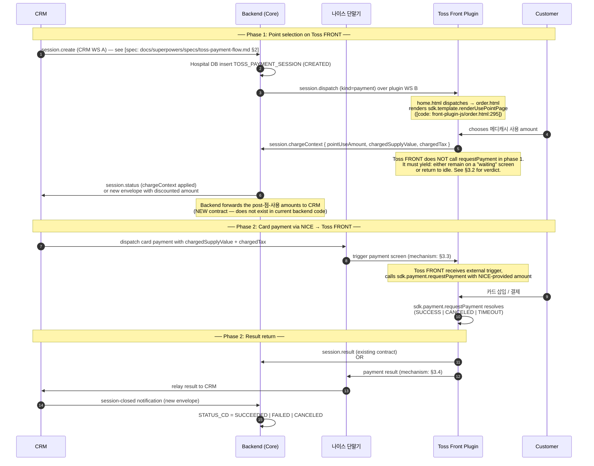
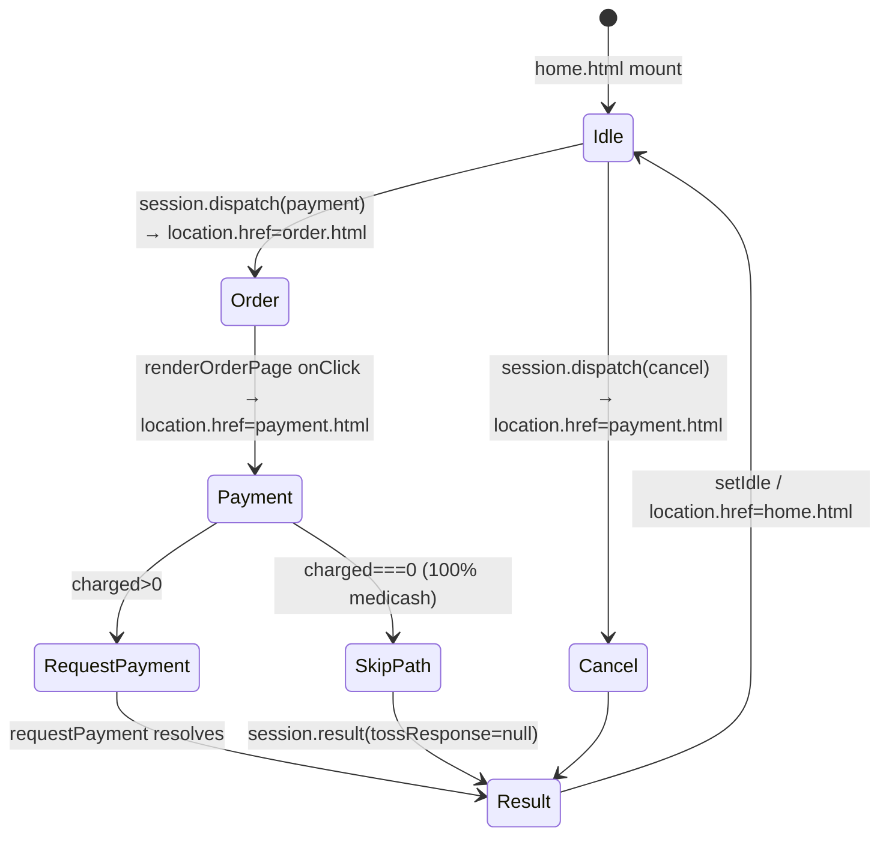
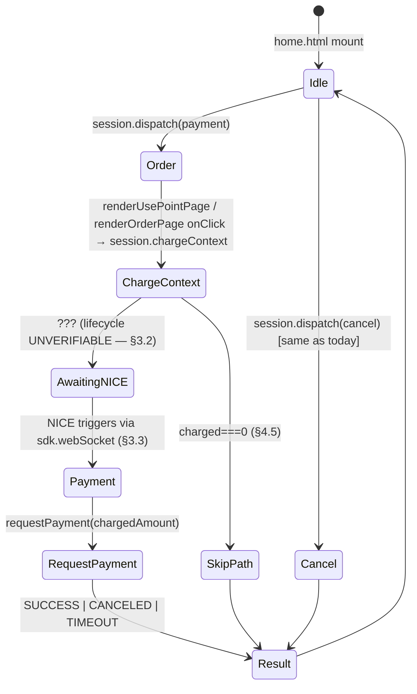
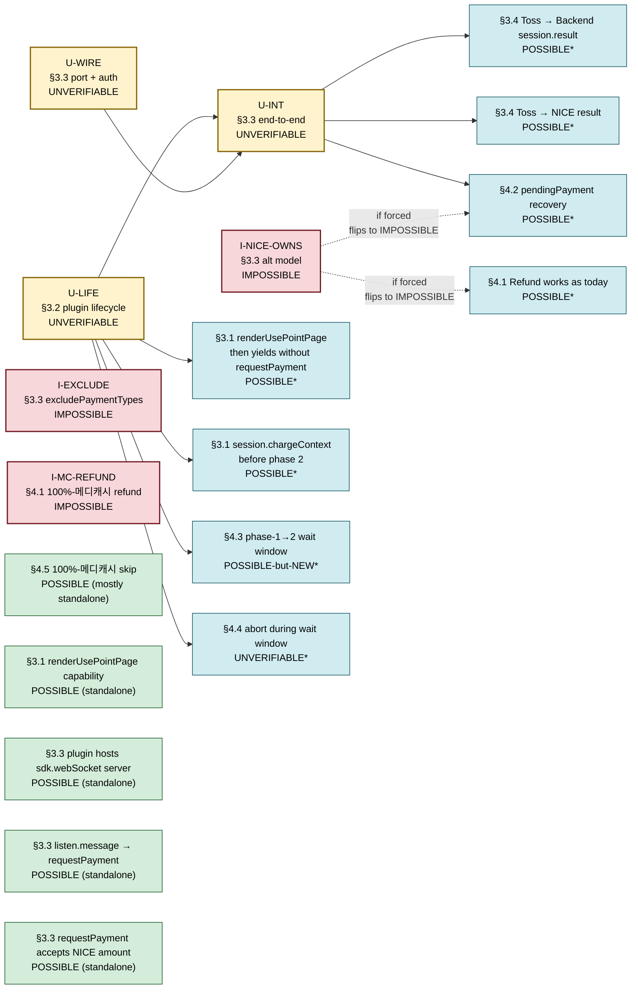

# Payment Flow with NICE Terminal — Feasibility Review

> **Status:** Feasibility review. **Replaces** the 2026-05-07 draft, which assumed Toss FRONT still owned `sdk.payment.requestPayment` and treated NICE as a relay between Backend/CRM and Toss. The new team-direction (2026-05-08) inserts NICE 카드 단말기 between CRM and Toss FRONT, splits the user-facing flow into a **point-selection phase** (Toss FRONT) and a **card-payment phase** (initiated by NICE), and shifts trigger ownership for `requestPayment` away from backend dispatch.
>
> **Compiled:** 2026-05-08.
> **Toss docs verified:** 2026-05-08 (see §10).
> **Local code surveyed:** [front-plugin-js/](../front-plugin-js/), [docs/superpowers/specs/](./superpowers/specs/).
> **Audience:** plugin team + backend team aligning on whether to commit to this architecture.

---

## 0. How to read this document

Every claim carries a citation tag. The verdict tags are exactly three:

- **[POSSIBLE]** — supported by Toss docs **and** doable with current or near-current plugin code.
- **[IMPOSSIBLE]** — explicitly contradicted by Toss docs, or contradicted by an SDK contract that has no documented workaround.
- **[UNVERIFIABLE]** — public Toss docs do not state one way or the other; needs Toss support, NICE vendor docs, or a real-device test to settle.

Citation tags:

- `[docs: <url>]` — verbatim Toss Place SDK doc, verified 2026-05-08. The five accessible reference URLs are listed in §10. Three pages returned 403 (`navigation.html`, `develop.html`, `scenario.html`) — flagged inline where relevant.
- `[code: <path>:<line>]` — repo file:line, current as of branch `develop` (2026-05-08).
- `[spec: <path>]` — repo spec file (these are themselves cited from `[docs: …]` and `[code: …]`).

For each **[IMPOSSIBLE]** and **[UNVERIFIABLE]** verdict, §5 lists 1–2 alternative architectures.

The scope is the **full payment lifecycle**: initial payment, refund/cancel, recovery (crash/reload), timeout, `session.abort`, and the 100%-메디캐시 skip path. Out of scope: code changes, contacting Toss/NICE support, sprint planning. Those belong to the follow-up driven by §6.

---

## 1. Executive verdict

> **The proposed four-party flow is partially feasible, with one critical caveat.**

The fundamental shift from the old single-session model to the new model is **trigger ownership**: who calls `sdk.payment.requestPayment`?

- **Old flow (still in code, 2026-05-08):** Backend dispatches `session.dispatch` over WebSocket B; Toss FRONT renders order/point pages and calls `sdk.payment.requestPayment` itself, all in one continuous plugin session. See [code: front-plugin-js/payment.html:222](../front-plugin-js/payment.html).
- **Proposed flow:** Toss FRONT only runs the point-selection phase; the actual `requestPayment` call is triggered by NICE 카드 단말기 after backend has reported the discounted amount back to CRM, and CRM has dispatched the card transaction to NICE.

### 1.1 Verdicts at a glance

**Marker legend** (added Gen 3 — see §7.3 dependency map): on POSSIBLE rows, **★** = standalone (no upstream UNVERIFIABLE/IMPOSSIBLE dependency); **⚠** = conditional (POSSIBLE only if the cited upstream root resolves favorably). UNVERIFIABLE/IMPOSSIBLE rows are themselves root nodes and carry no marker.

| Mark | Topic | Verdict | Where |
|---|---|---|---|
| ⚠ §3.2 | Phase-1 split: render `renderUsePointPage` only, dismiss without `requestPayment` | **[POSSIBLE]** | §3.1 |
| ⚠ §3.2 | Phase-1 → backend handoff of pointUse via WebSocket B | **[POSSIBLE]** | §3.1 |
| | Phase-1 → Phase-2 lifecycle: plugin stays foreground vs. returns to idle | **[UNVERIFIABLE]** | §3.2 |
| ★ | Phase-2 trigger: NICE → Toss FRONT — SDK *capability* (plugin handler invokes `requestPayment`) | **[POSSIBLE]** | §3.3 |
| | Phase-2 trigger: NICE → Toss FRONT — *end-to-end integration* (port discovery + auth + foreground/idle) | **[UNVERIFIABLE]** | §3.3 |
| | Phase-2 trigger: NICE bringing Toss FRONT plugin to foreground from idle | **[UNVERIFIABLE]** | §3.3 |
| | Phase-2 trigger: out-of-band port discovery for NICE→plugin connection | **[UNVERIFIABLE]** | §3.3 |
| | Phase-2 trigger: auth/trust on `sdk.webSocket` external clients | **[UNVERIFIABLE]** ([GAP]) | §3.3 |
| ⚠ §3.3 U-INT | Phase-2 payment: Toss FRONT calls `sdk.payment.requestPayment` after NICE trigger | **[POSSIBLE]** | §3.3 |
| | Alternative phase-2: NICE processes card outside Toss FRONT, Toss FRONT retrieves via `getPayment` | **[IMPOSSIBLE]** | §3.3 |
| | `excludePaymentTypes` values other than `['CASH']` | **[IMPOSSIBLE]** | §3.3 |
| ⚠ §3.3 I-NICE-OWNS | Refund: `sdk.payment.requestPaymentCancel` works as today | **[POSSIBLE]** | §4.1 |
| | Refund: when NICE owns the card transaction (not Toss FRONT) | **[IMPOSSIBLE]** | §4.1 |
| ⚠ §3.3 I-NICE-OWNS | Recovery: pendingPayment + `getPayment` survives the new model | **[POSSIBLE]** if Toss FRONT calls `requestPayment` | §4.2 |
| ★ | Timeout: `requestPayment` `timeoutMs` semantics unchanged | **[POSSIBLE]** | §4.3 |
| ★ | `session.abort`: existing CRM-driven abort works in DISPATCHED state | **[POSSIBLE]** | §4.4 |
| | `session.abort`: external NICE-triggered phase 2 — abortability | **[UNVERIFIABLE]** | §4.4 |
| ★ | 100%-메디캐시 skip path: bypass NICE entirely | **[POSSIBLE]** but requires routing decision | §4.5 |

### 1.2 The single biggest risk

**If "NICE triggers Toss FRONT" only works while the plugin is already in foreground**, then phase-1 → phase-2 requires Toss FRONT to stay open across the boundary. Public docs do not document any external mechanism to bring an idle plugin to foreground. `sdk.app.setIdle()` is documented `[docs: app.html]` but the inverse — "wake the plugin" or "launchPlugin from external" — is not present in any verified reference page.

This is the single highest-priority unverifiable item. **Real-device testing is required** before the team commits to the new architecture; see §6 for the exact escalation paths.

---

## 2. The proposed new flow

### 2.1 Sequence diagram (proposed)

### 2.2 What changed vs. the 2026-05-07 draft

The previous draft `[superseded: docs/payment-flow-with-nice-terminal.md (pre-2026-05-08)]` modelled NICE as a stateless **relay** between Backend and Toss, while still placing `sdk.payment.requestPayment` inside Toss FRONT in a single continuous session. The new model differs in three concrete ways:

1. **Toss FRONT yields between phases.** It renders `renderUsePointPage` and stops, instead of continuing to `requestPayment`. The mechanism by which it "stops and resumes" is the central uncertainty — see §3.2.
2. **NICE is the trigger of phase 2**, not a relay. NICE owns the moment when card payment begins.
3. **Asymmetric routing on the return path.** Result may flow Toss → Backend (existing) and/or Toss → NICE → CRM (new). The double-write risk is enumerated in §3.4.

---

## 3. Per-step feasibility

### 3.1 Phase 1 — CRM → Backend → Toss FRONT (point selection only)

| Step | Verdict | Citation | Notes |
|---|---|---|---|
| CRM → Backend `session.create` over WS A | **[POSSIBLE]** | `[spec: docs/superpowers/specs/toss-payment-flow.md §2]` | Already implemented |
| Backend → Plugin `session.dispatch` (kind=payment) over WS B | **[POSSIBLE]** | `[code: front-plugin-js/home.html:144]`, `[spec: §3]` | Already implemented |
| Plugin renders `sdk.template.renderUsePointPage` | **[POSSIBLE]** | `[docs: template.html]`, `[code: front-plugin-js/order.html:295]` | Already implemented |
| Plugin renders `sdk.template.renderOrderPage` (preview before card payment) | **[POSSIBLE]** but optional | `[docs: template.html]`, `[code: front-plugin-js/order.html:250]` | Whether to keep this as a confirmation screen in the new flow is a UX decision, not a feasibility one |
| Plugin sends `session.chargeContext` to backend BEFORE phase 2 | **[POSSIBLE]** | `[spec: docs/superpowers/specs/toss-payment-flow.md §5]`, `[code: front-plugin-js/payment.html:126-134]` | Existing contract; payload pre-exists. Sending it from order.html (instead of payment.html) is the new wiring |
| Plugin **dismisses without calling** `sdk.payment.requestPayment` *(end-to-end depends on §3.2 lifecycle resolution — the SDK affords the dismiss; whether the plugin can usefully yield until phase 2 is the gating question)* | **[POSSIBLE]** | `[docs: template.html]` — `cta.cancel` callback on `renderUsePointPage` allows dismiss; `[docs: plugin/intro.html]` documents pre-payment scenarios verbatim: "**결제 전: 고객 정보 확인, 포인트 적립**" | Toss explicitly supports plugins that run pre-payment phases |
| Backend → CRM forwards the post-점-사용 amounts | **[POSSIBLE]** but **NEW** | None exist for this exact envelope | Backend currently sends `session.status` only on state changes. A new payload (or extension of `session.status`) is needed to carry `chargedSupplyValue` + `chargedTax` to CRM. **Doc-only flag — implementation falls outside this review** |

Net for phase 1: **POSSIBLE** with a backend-contract addition. No Toss SDK obstacle.

### 3.2 Phase 1 → Phase 2 transition (Toss FRONT lifecycle)

The most uncertain question in this review.

| Sub-question | Verdict | Citation |
|---|---|---|
| Can Toss FRONT plugin remain on a "waiting for NICE" screen across an arbitrary delay? | **[UNVERIFIABLE]** | `[docs: template.html]` does not document a "wait page" template. `renderResultPage` has `timerMs` between 3000–10000 ms (default 5000) and a required `onTimeout` callback, so it cannot be a long wait. `renderIdlePage` (type "default") does not document a maximum duration. `[docs: app.html]` `setIdle()` is one-way ("첫화면으로 이동합니다") — no documented "wakeFromIdle" |
| If Toss FRONT calls `sdk.app.setIdle()` between phases, can NICE bring it back to foreground? | **[UNVERIFIABLE]** | No documented external-wake mechanism in `[docs: app.html]`. `sdk.webSocket` may be running on the WebView even while `renderIdlePage` is shown — `[docs: websocket.html]` does not state that the server is suspended on idle. Real-device test required |
| Does sessionStorage / `sdk.storage` survive across `setIdle()` → re-entry? | **[POSSIBLE]** for `sdk.storage`; **[UNVERIFIABLE]** for `sessionStorage` | `[docs: storage.html]` — `sdk.storage.set/get/remove/clear`, plus `[GAP]` "Storage quota, persistence across reinstall, and scope are not documented" `[spec: docs/superpowers/specs/2026-04-27-frontend-plugin.md §2.6]`. For `sessionStorage`, browser semantics depend on whether the WebView reloads on plugin re-entry; not documented. Existing code already uses `sdk.storage` for `smartdoctor.pendingPayment` recovery `[code: front-plugin-js/config.js:33]`, so the recovery path itself does not depend on `sessionStorage` |
| If Toss FRONT calls `sdk.app.setIdle()` between phases, will a fresh page load on phase 2 break the WS B context? | **[POSSIBLE — already handled]** | `home.html` already implements WS reconnect and pendingPayment recovery `[code: front-plugin-js/home.html:54-67, :108-122]`. A new mount on phase 2 would re-open WS B, run recovery, and (assuming WebSocket server restart works on re-entry) accept NICE's trigger |

**This is the highest-priority real-device verification item.** Two sub-cases have very different implications:

- **Case A — plugin stays foreground between phases.** The phase-1 page (e.g., a custom "결제 단말기로 카드를 삽입해주세요" screen, or `renderResultPage` with a long `timerMs` if Toss permits) keeps the plugin alive. NICE connects to the still-running `sdk.webSocket` server and triggers `requestPayment`. **No state-loss problem.**
- **Case B — plugin returns to idle between phases.** NICE must re-launch the plugin from idle. **The mechanism for "external launch from idle" is undocumented**, so Case B is `[UNVERIFIABLE]`.

The teammate's anecdote ("initiating from NICE makes the 결제 screen pop up in Toss FRONT") suggests Case A or an undocumented-but-functional Case B mechanism (Android intent, VAN signal, etc.). Without device access, we cannot tell which.

### 3.3 Phase 2 — CRM → NICE → Toss FRONT (card payment)

| Sub-question | Verdict | Citation |
|---|---|---|
| Toss FRONT plugin can host a WebSocket SERVER for external clients (e.g., NICE) to connect to | **[POSSIBLE]** | `[docs: websocket.html]` verbatim: "WebSocket 서버를 생성하고 클라이언트와 양방향 통신을 하기 위한 API입니다" — methods `start`, `open`, `send`, `close`; events `listen.connection`, `listen.message`, `listen.disconnection`, `listen.error` |
| The plugin can bind to a fixed port for predictability | **[POSSIBLE]** | `[docs: websocket.html]` — `params.port` (default `0` = auto-assign); a fixed port can be specified |
| External client (NICE) can discover the WebSocket port | **[UNVERIFIABLE]** ([GAP]) | `[docs: websocket.html]` — no port-registry / service-discovery primitive documented. Out-of-band coordination required (e.g., NICE configured with a fixed port that Toss FRONT also binds to) |
| Auth / trust model on `sdk.webSocket` for external clients | **[UNVERIFIABLE]** ([GAP]) | `[docs: websocket.html]` — no params for keys, tokens, or origin checks |
| Plugin's `listen.message` handler can invoke `sdk.payment.requestPayment` (SDK capability, in isolation) | **[POSSIBLE]** | `[docs: websocket.html]` `listen.message` callback receives a string; the plugin's own message handler can call `sdk.payment.requestPayment(...)`. The wiring is plugin-defined — Toss provides no opinionated trigger schema |
| End-to-end "NICE actually triggers Toss FRONT's `requestPayment` in production" | **[UNVERIFIABLE]** | This is a *composite* of the four rows above (server hosting, port discovery, auth/trust, foreground/idle wake) plus the SDK-capability row. Three of the four prerequisite rows are themselves [UNVERIFIABLE]; therefore the integration is [UNVERIFIABLE] regardless of the SDK call being [POSSIBLE] in isolation. Re-graded from "POSSIBLE in principle" — see Generation-2 evolution note in §11 |
| The plugin can be brought to foreground / activated from idle by an external trigger | **[UNVERIFIABLE]** ([GAP]) | No documented external-wake mechanism. `[docs: app.html]` exposes `setIdle`, `restartOnboarding`, `openSetting`, `getMerchant`, `getSerialNumber`, `isDebugMode`, `getMerchant` — nothing that lets external code launch the plugin. The teammate's observation may exploit a Toss-internal Android intent or the WebSocket server staying live on idle; both unverifiable from public docs |
| `sdk.payment.requestPayment` accepts a fresh trigger after the plugin yielded between phases | **[POSSIBLE]** | `[docs: payment.html]`, `[spec: docs/superpowers/specs/2026-04-27-frontend-plugin.md §2.1]`. `requestPayment` has no documented "session continuity" requirement — it is a single Promise-returning SDK call. Idempotency is `[GAP]` per `[spec: §2.10]` (Toss Payments product idempotency window does not necessarily apply to plugin SDK), but this only matters for retries, not the single trigger |
| `requestPayment` accepts the discounted amount from NICE | **[POSSIBLE]** | `[docs: payment.html]` — required params are `paymentKey`, `tax`, `supplyValue`, `tip`. No constraint on where these values come from |
| `excludePaymentTypes` carries values other than `['CASH']` | **[IMPOSSIBLE]** | `[docs: payment.html]` verbatim: "제외할 결제 수단 (현재 현금만 지원)" — "currently only CASH is supported." Default is undocumented `[GAP]`. v1 must continue to send `['CASH']` |
| **Alternative model**: NICE processes the card transaction OUTSIDE Toss FRONT (using its own VAN integration) and Toss FRONT later retrieves the result via `getPayment` | **[IMPOSSIBLE]** | `[docs: payment.html]` verbatim: "결제를 요청한 단말기에서만 조회할 수 있습니다. 다른 단말기나 서버에서는 조회할 수 없습니다." `getPayment` only returns payments **made by this device's `sdk.payment.requestPayment`**. A NICE-side card transaction is invisible to `sdk.payment.getPayment`. Refund (§4.1) is also impossible in this case |

Net for phase 2: the SDK *capability* to wire `sdk.webSocket` → `requestPayment` is **POSSIBLE** in isolation, but the *end-to-end integration with NICE* is **UNVERIFIABLE** — gated on port discovery, auth/trust, and the foreground/idle question. The alternative of "NICE owns the card transaction, Toss observes" is **IMPOSSIBLE** under documented Toss SDK semantics.

### 3.4 Phase 2 → Result return path

| Sub-question | Verdict | Citation |
|---|---|---|
| Toss FRONT → Backend `session.result` over existing WS B | **[POSSIBLE]** — already implemented | `[code: front-plugin-js/payment.html:262]`, `[spec: §6]` |
| Toss FRONT → NICE result over `sdk.webSocket` (plugin sends back to the same client that triggered) | **[POSSIBLE]** | `[docs: websocket.html]` — `send` method takes `serverId` + `connectionId`; `connectionId` is provided in the `listen.message` event |
| NICE → CRM directly bypassing Backend (per the previous 2026-05-07 draft) | **[POSSIBLE]** as a NICE↔CRM contract | Out of Toss SDK scope; depends on NICE/CRM integration, not on Toss feasibility |
| Both `Toss → Backend` AND `Toss → NICE → CRM` simultaneously | **[POSSIBLE]** but creates a double-write risk | Backend would record `SUCCEEDED` based on `session.result`; CRM would also record success via NICE. If the two write paths can disagree (e.g., NICE drops the relay), the system could land in a CRM/Backend inconsistency. **Recommend single-source-of-truth: keep the Backend write authoritative.** This is a contract-design decision, not a Toss SDK feasibility question |
| Routing decision when 100%-메디캐시 (no card needed) | See §4.5 | The current code skips `requestPayment` entirely and sends `session.result` with `tossResponse: null` `[code: front-plugin-js/payment.html:142-191]` |

Net: result return is **POSSIBLE** under several routing options. The team should pick one canonical route (recommendation: Toss → Backend, with backend pushing notification to CRM, mirroring the current contract) to avoid double-write inconsistency.

---

## 4. Lifecycle path verdicts

### 4.1 Refund / Cancel (`sdk.payment.requestPaymentCancel`)

`requestPaymentCancel` requires `paymentKey`, `paymentMethod`, `tax`, `supplyValue`, `tip`, `timestamp`, `approvalNumber` `[docs: payment.html]`, `[spec: §2.1]`.

| Sub-question | Verdict | Citation |
|---|---|---|
| Refund works as today **if Toss FRONT itself called `requestPayment` in phase 2** | **[POSSIBLE]** | `[code: front-plugin-js/payment.html:385]`. Backend persists the full `tossResponse` at SUCCESS time `[spec: docs/superpowers/specs/toss-payment-flow.md §6]` and reconstructs `cancelParams` on `refund.create` `[spec: §10]`. Trigger ownership of the original payment does not affect this path |
| Refund of the 100%-메디캐시 path (where Toss FRONT did NOT call `requestPayment`) | **[IMPOSSIBLE]** at the SDK level | `[code: front-plugin-js/payment.html:142-191]`, `[spec: docs/superpowers/specs/toss-payment-flow.md §10]`: "100% 메디캐시 결제는 Toss 승인 정보가 없으므로 현재 `refund.create`에서 plugin cancel dispatch를 만들 수 없다. 메디캐시 복원/차감 flow는 별도 API/정책이 필요하다." This is unchanged by the new flow — same caveat applies |
| Refund **if NICE owns the card transaction** (alternative-model phase 2) | **[IMPOSSIBLE]** | `requestPaymentCancel` requires fields from the original `requestPayment` SUCCESS response. If NICE issued the card transaction, no Toss-side response exists. `getPayment` is device-local and only knows about `sdk.payment.requestPayment` invocations `[docs: payment.html]`. NICE-issued transactions cannot be cancelled via Toss SDK |
| Refund dispatch via `session.dispatch (kind=cancel)` | **[POSSIBLE]** unchanged | `[code: front-plugin-js/home.html:154-156]` already routes cancel-kind dispatches to `payment.html`. Existing wiring survives |
| Refund initiated from NICE side instead of CRM/Backend | **[UNVERIFIABLE]** for the trigger; **[POSSIBLE]** for the actual SDK call | The actual `sdk.payment.requestPaymentCancel` call is the same regardless of who triggered the refund. But routing the trigger via NICE → Toss FRONT creates the same `[UNVERIFIABLE]` external-trigger concerns as §3.3 |

Net: refund works **if and only if Toss FRONT itself ran `requestPayment` in phase 2**, which is the default case under the proposed flow with `sdk.webSocket` triggering. The 100%-메디캐시 caveat is unchanged.

### 4.2 Recovery (crash / page reload)

The current recovery path reads `smartdoctor.pendingPayment` from `sdk.storage` on each page load and resolves it via `sdk.payment.getPayment` `[code: front-plugin-js/config.js:39-110, front-plugin-js/home.html:108-122]`.

| Sub-question | Verdict | Citation |
|---|---|---|
| Pending-payment storage survives a phase-1 → phase-2 boundary if Toss FRONT yields | **[POSSIBLE]** | `sdk.storage` is documented as device-persistent `[docs: storage.html]`. `[GAP]` per `[spec: §2.6]` is about quota/scope, not core durability. The plugin already writes `pendingPayment` immediately before `requestPayment` `[code: front-plugin-js/payment.html:197]`, so a phase-2 trigger that calls `requestPayment` will continue to populate it on schedule |
| Pending-payment recovery on phase-2 plugin re-mount works | **[POSSIBLE]** | `home.html` already runs `runPendingPaymentRecovery` on every connect `[code: front-plugin-js/home.html:114, front-plugin-js/config.js:39]`. The recovery sends `session.result` with `late: true` to backend |
| `sdk.payment.getPayment` finds the payment when phase 2 happened on the same device | **[POSSIBLE]** | `[docs: payment.html]` — device-local cache: "결제를 요청한 단말기에서만 조회할 수 있습니다. … TTL 14일, 최대 1,000건" |
| Recovery if the phase-2 trigger went via NICE but Toss FRONT crashed mid-`requestPayment` | **[POSSIBLE]** | `requestPayment` was called by Toss FRONT itself, so the cache contains the result. Recovery proceeds as today |
| Recovery if NICE owned the card transaction (alt-model) | **[IMPOSSIBLE]** | Same reason as §4.1 — `getPayment` cannot see NICE-side transactions |

Net: recovery is **POSSIBLE** under the canonical flow (Toss FRONT runs `requestPayment` after NICE trigger). It is **IMPOSSIBLE** under the alternative model where NICE owns card processing.

### 4.3 Timeout (`requestPayment` `timeoutMs`)

| Sub-question | Verdict | Citation |
|---|---|---|
| `requestPayment` honors `timeoutMs` (default 60000) | **[POSSIBLE]** unchanged | `[docs: payment.html]`, `[spec: §2.1]` |
| Backend's `IN_PROGRESS > timeoutMs + 30s → EXPIRED` | **[POSSIBLE]** unchanged | `[spec: docs/superpowers/specs/toss-payment-flow.md §9]` |
| `session.reconcile` arrives after EXPIRED, plugin replies with cached result | **[POSSIBLE]** unchanged | `[code: front-plugin-js/home.html:166-231]`, `[spec: §9]` |
| Phase-1 timeout (user lingers on `renderUsePointPage`) | **[POSSIBLE]** but **NEW boundary** | `renderUsePointPage` itself has no documented timeout `[docs: template.html]`. Backend's existing 30s `DISPATCHED → FAILED/PLUGIN_UNRESPONSIVE` timer applies until plugin sends `session.claim`. After claim, `IN_PROGRESS` is bounded by `timeoutMs + 30s`, which is currently 60000+30000 = 90s — too short for "wait for NICE." **The phase-1→2 wait window must be redesigned in backend's session timer, or backend must accept an indefinite IN_PROGRESS window when chargeContext is received without a subsequent session.result.** Doc-only flag — implementation falls outside this review |
| Phase-2 NICE-side trigger never arrives (NICE offline / customer walks away) | **[POSSIBLE]** to detect, but requires backend timer redesign | Same as above |

Net: SDK-level timeout is **POSSIBLE** unchanged; the **backend session-timer policy needs revisiting** because the phase-1→2 wait window can exceed `timeoutMs + 30s`. This is a backend-contract concern, not a Toss SDK obstacle.

### 4.4 `session.abort`

Current contract `[spec: docs/superpowers/specs/toss-payment-flow.md §7-8]`:

- CRM-driven abort: allowed in `CREATED` and `DISPATCHED`; rejected after `IN_PROGRESS`.
- Plugin-driven abort: emitted on `USER_BACKED_OUT` from order/use-point page.

| Sub-question | Verdict | Citation |
|---|---|---|
| CRM-driven abort during phase 1 (DISPATCHED → CRM cancels before Toss FRONT claims) | **[POSSIBLE]** unchanged | `[code: front-plugin-js/home.html:233-240]`, `[code: front-plugin-js/order.html:121-130]`, `[spec: §7]` |
| Plugin-driven abort during phase 1 (`renderUsePointPage` back-arrow, `USER_BACKED_OUT`) | **[POSSIBLE]** unchanged | `[code: front-plugin-js/order.html:308-323, :265-283]`, `[spec: §8]` |
| CRM-driven abort during the phase-1→2 wait window (after `session.chargeContext`, before `session.result`) | **[UNVERIFIABLE]** with current contract | Backend currently treats `IN_PROGRESS` as un-abortable `[spec: §7]`: "IN_PROGRESS abort 요청은 거부한다." Under the new flow, the phase-1→2 wait IS in `IN_PROGRESS`. Whether to relax this or keep it is a backend-contract decision; the plugin-side mechanism (`session.abort` over WS B → `sdk.app.setIdle()`) already exists `[code: front-plugin-js/home.html:233-240]`. **Recommend backend introduces a new sub-state (e.g., `AWAITING_NICE`) that is abortable, distinct from `IN_PROGRESS` (Toss SDK in flight)** |
| Plugin-driven abort during the phase-1→2 wait window | **[UNVERIFIABLE]** | If Toss FRONT shows a "waiting for NICE" screen, the back-arrow behavior depends on whichever template is used. `renderResultPage` does NOT have `onBack` `[docs: template.html]`, `[spec: §2.3]`. `renderIdlePage` is idle and back-arrow has no effect. A custom waiting screen would need a Template API page that supports `onBack` — `renderUsePointPage`, `renderSelectPage`, etc. all have it. **Picking the right template for the wait screen is a UX decision deferred to implementation** |
| External NICE-side abort propagates to Toss FRONT | **[UNVERIFIABLE]** | Depends on NICE-side abort signal. If NICE sends an abort message via `sdk.webSocket`, the plugin handler can `setIdle` and emit `session.abort` over WS B. **Plugin-side wiring is feasible**; NICE-side feasibility is out of Toss SDK scope |

Net: existing abort paths are unaffected. The new phase-1→2 wait window introduces an abortability gap that is `[UNVERIFIABLE]` under the current backend state machine and needs either a backend state-machine extension or a UX decision on the wait screen.

### 4.5 100%-메디캐시 skip path

When the customer's available 메디캐시 covers the entire treatment cost, the current flow `[code: front-plugin-js/payment.html:142-191]` skips `requestPayment` entirely and sends `session.result` with `tossResponse: null`.

| Sub-question | Verdict | Citation |
|---|---|---|
| Skip path is doable in Toss FRONT plugin alone | **[POSSIBLE]** unchanged | `[code: front-plugin-js/payment.html:142-191]`, `[spec: §6]` |
| When skip path triggers, NICE phase 2 should be **bypassed** | **[POSSIBLE]** but **NEW routing decision** | Currently the plugin sends `session.result` directly, then renders `renderResultPage`. Under the new flow, the plugin must signal backend "no card payment needed; bypass NICE dispatch." Backend → CRM contract needs a 100%-coverage signal so CRM does NOT dispatch to NICE. Doc-only flag — backend/CRM contract addition |
| Skip path can call NICE through anyway (sending a 0-amount card request) | **[POSSIBLE]** but **NOT RECOMMENDED** | Toss `requestPayment` behavior at `tax=0/supplyValue=0` is `[GAP]` `[spec: §2.10]`: "Toss docs only document non-zero requestPayment examples and don't specify behavior at tax=0/supplyValue=0." Sending NICE a 0-amount card transaction risks NICE-side rejection or undefined behavior on Toss `requestPayment` |
| Refund of skip-path payments | **[IMPOSSIBLE]** at SDK level — same as today | See §4.1 |

Net: skip path is unchanged at the SDK level; the **CRM→NICE dispatch decision must be conditioned on `pointUseAmount === treatmentTotal`**. This is a backend/CRM contract addition, not a Toss SDK obstacle.

---

## 5. Alternative architectures

For each `[IMPOSSIBLE]` and `[UNVERIFIABLE]` verdict, 1–2 alternative architectures.

### 5.1 If "external trigger from idle" (§3.2 / §3.3) turns out to be impossible on real device

**Alternative A — Always-foreground wait screen.**
Toss FRONT renders a custom waiting Template API page after `session.chargeContext` (e.g., `renderResultPage` with a long `timerMs`, or a more appropriate waiting template if Toss provides one). The `sdk.webSocket` server is started during this wait. NICE connects to the running server and sends a "begin payment" message. The plugin's `listen.message` handler calls `sdk.payment.requestPayment`. **Pros:** no external-wake question. **Cons:** the device is locked on Toss FRONT during the entire phase-1→2 window; the customer must remain at the Toss device, not at a separate NICE terminal.

**Alternative B — User-driven phase-2 entry on Toss FRONT.**
After phase 1, Toss FRONT renders a page showing "카드를 단말기에 삽입해주세요" with a "결제 시작" button. The customer (not NICE) manually advances; Toss FRONT calls `requestPayment`. NICE is no longer the trigger — it becomes a passive card reader the user inserts the card into during `requestPayment`. **Pros:** zero `[UNVERIFIABLE]` items; the existing flow extends naturally. **Cons:** loses the original motivation for inserting NICE between CRM and Toss; the architecture is barely different from today's. (This is essentially the **2026-05-07 draft minus the relay framing**.)

### 5.2 If `sdk.webSocket` cannot be reached by NICE (port discovery / auth, §3.3)

**Alternative C — Backend-mediated trigger.**
NICE never connects to Toss FRONT directly. CRM tells NICE the discounted amount, NICE sends a "ready" signal back to CRM, CRM tells Backend, Backend sends a new WS B message (e.g., `session.proceed`) to Toss FRONT, plugin calls `requestPayment`. **Pros:** uses only the existing WS B (no `sdk.webSocket` complexity); auth/discovery is handled by backend's existing trust model. **Cons:** Backend becomes the synchronous dispatcher — adds latency and another moving part in the critical-path payment moment.

**Alternative D — Skip NICE entirely for trigger; keep NICE for card-reader hardware only.**
Toss FRONT calls `requestPayment` directly when the user clicks "결제 시작" on Toss FRONT (per Alternative B). NICE provides only the physical card-reader hardware that Toss FRONT delegates to via the device's normal payment chain. **Pros:** matches Toss's documented model 1-for-1 — `sdk.payment.requestPayment` runs on Toss FRONT as today. **Cons:** if NICE has its own VAN integration that bypasses Toss's payment chain, this isn't actually NICE-as-card-reader — it's NICE-as-second-payment-system, which is `[IMPOSSIBLE]` (§3.3 alternative-model row).

### 5.3 If the alternative model "NICE owns card transaction" must be supported (§3.3, §4.1, §4.2)

**Alternative E — Bypass Toss FRONT for the actual transaction, use Toss FRONT for receipts only.**
NICE handles the entire card transaction with its own VAN. Toss FRONT is used only as a 영수증 출력 단말기 — render `renderResultPage` after CRM tells backend "NICE confirmed." `sdk.payment.requestPayment` is never called for these payments. **Pros:** sidesteps the `[IMPOSSIBLE]` `getPayment` device-local restriction. **Cons:** loses every Toss-side benefit — receipt issuance, 메디캐시 ledger integration via Toss, `requestPaymentCancel`. Refunds must be done entirely via NICE/CRM, with the existing 메디캐시 deduction reversal `[spec: docs/superpowers/specs/toss-payment-flow.md §10]` retained on Backend for the points side. This is a strategic pivot, not a technical workaround.

### 5.4 If the phase-1→2 timeout window exceeds `timeoutMs + 30s` (§4.3)

**Alternative F — Two-stage backend session state.**
Backend introduces an `AWAITING_NICE` state between `IN_PROGRESS` (post-`session.claim`) and `IN_PROGRESS` (post-`session.chargeContext`). `AWAITING_NICE` is bounded by a longer timer (e.g., 5 minutes), is abortable from CRM, and transitions to `IN_PROGRESS` only when phase 2's `requestPayment` actually starts. The plugin signals state transitions via WS B. **Pros:** preserves the existing `IN_PROGRESS` semantics for SDK-bounded windows; gives CRM a real abort path during the wait. **Cons:** new state to track, new timer, new transitions — non-trivial backend change.

**Alternative G — Treat phase 1 and phase 2 as separate sessions.**
Phase 1 ends with backend persisting `pointUseAmount` against a sessionId, and the session moves to a `COMPLETED_POINT_PHASE` terminal-ish state. Phase 2 starts a NEW session (NICE → CRM → backend → plugin) that references the phase-1 sessionId. **Pros:** every session has a bounded SDK timer; recovery and abort semantics are clean per session. **Cons:** double the orchestration; refund logic must coalesce two sessions; the data model needs a parent/child relation in `TOSS_PAYMENT_SESSION`.

### 5.5 If the 100%-메디캐시 skip path needs to coordinate with NICE bypass (§4.5)

**Alternative H — Backend conditionally skips CRM→NICE dispatch.**
On `session.chargeContext` where `pointUseAmount === treatmentTotal AND chargedSupplyValue === 0`, backend immediately notifies CRM "skip NICE; payment is points-only" and treats the eventual plugin `session.result` (with `tossResponse: null`) as the terminal state. **Pros:** keeps the existing skip path intact. **Cons:** small CRM-contract addition.

**Alternative I — Always route through NICE; NICE no-ops on zero-amount.**
Backend always tells CRM to dispatch to NICE; NICE explicitly no-ops a 0-amount transaction and signals "skip" back. **Pros:** uniform flow regardless of skip. **Cons:** NICE-side support for zero-amount no-ops is `[UNVERIFIABLE]` — depends on NICE behavior, not Toss.

---

## 6. Open questions for follow-up

These items are unverifiable from public Toss documentation. Each requires escalation; the deliverable of this review is to surface them, not resolve them.

### 6.1 Real-device test required (Toss SDK behavior)

1. **Plugin foreground/idle behavior with `sdk.webSocket` running.** Does the WebSocket server keep accepting connections while the plugin is on `renderIdlePage`? Or does idle suspend WebView execution? — **Highest priority. Gates §3.2 / §3.3.**
2. **External-wake from idle.** Is there ANY mechanism (Android intent, NICE-platform signal, undocumented `sdk.app` method) that brings the plugin to foreground from idle? Test by observing the teammate's "NICE triggers Toss FRONT" scenario directly with logs/dev tools.
3. **`sessionStorage` durability** across `setIdle()` → re-entry. (Not load-bearing if `sdk.storage` is used instead, but answering it clarifies the lifecycle.)
4. **`renderResultPage` long timer.** Does `timerMs` accept values above the documented 3000–10000 range? (Needed for Alternative A waiting screen.)

### 6.2 Toss support escalation

5. **Documented support for "pre-payment-only" flows.** `[docs: plugin/intro.html]` lists "결제 전: 고객 정보 확인, 포인트 적립" as a use case but does not document a hand-off to external payment. Confirm Toss's intended pattern.
6. **`navigation.html` (403)** — repeated `[GAP]`. Re-attempt with partner credentials.
7. **`sdk.webSocket` auth/trust model.** Confirm whether Toss has guidance for securing the plugin's WebSocket server against rogue local clients on the same network.
8. **`sdk.app.setIdle` reverse.** Is there a documented mechanism to bring the plugin to foreground from external code?

### 6.3 NICE 카드 단말기 vendor / team SME

9. **Trigger mechanism the teammate observed.** Direct conversation with the teammate who saw "NICE → Toss FRONT 결제 화면 pops up" — what specific NICE configuration / message produced that behavior? This is the cheapest single piece of evidence to reduce §3.2/§3.3 uncertainty.
10. **NICE's protocol with Toss FRONT.** If `sdk.webSocket` is the channel, what JSON schema does NICE send? If it's a Toss-internal Android intent, what intent name + payload? Vendor docs from NICE should clarify.
11. **NICE's behavior on zero-amount transactions.** (Alternative I.)
12. **NICE's refund / void path.** Does NICE expect Toss FRONT to issue the refund (per §4.1 canonical model), or does NICE handle refunds independently?

### 6.4 Backend-contract decisions (deferred to implementation)

13. **Phase-1→2 session timer policy** (§4.3 / Alternative F).
14. **`session.proceed` or equivalent** to dispatch the post-점-사용 amount onward (§3.1 last row).
15. **Skip-path bypass signal** to CRM for 100%-메디캐시 (§4.5 / Alternative H).
16. **Result-routing single-source-of-truth** (§3.4).

---

## 7. State diagrams

### 7.1 Current Toss FRONT plugin lifecycle (2026-05-08)

### 7.2 Proposed Toss FRONT plugin lifecycle (new flow)

The `AwaitingNICE` state is the central uncertainty. Its concrete representation depends on §3.2 outcomes:

- If "always foreground" (Alternative A): a Template API page with the `sdk.webSocket` server running.
- If "external wake works" (`[UNVERIFIABLE]`): `Idle` itself, with `sdk.webSocket` running underneath.
- If "two-stage sessions" (Alternative G): two distinct plugin sessions, each running its own short-lived state machine.

### 7.3 Verdict dependency map

The 72 verdicts in §3 / §4 are **not independent**. Many POSSIBLE rows are SDK-level capability confirmations whose end-to-end usefulness depends on the small set of UNVERIFIABLE / IMPOSSIBLE root nodes. This map shows which downstream POSSIBLEs hinge on which roots — a reader scanning §1.1 should not treat the POSSIBLE rows as 44 independent green lights.

**Root nodes** (the items that gate everything else):

| Root | Verdict | Where | Description |
|---|---|---|---|
| **U-LIFE** | UNVERIFIABLE | §3.2 | Phase-1→2 plugin lifecycle: stays foreground vs. returns to idle vs. external-wake |
| **U-WIRE** | UNVERIFIABLE | §3.3 | NICE↔plugin wire: port discovery + auth/trust on `sdk.webSocket` |
| **U-INT** | UNVERIFIABLE | §3.3 | End-to-end integration row (composite of U-LIFE + U-WIRE — added in Gen 2) |
| **I-NICE-OWNS** | IMPOSSIBLE | §3.3 | "NICE processes card outside Toss FRONT, Toss FRONT retrieves via `getPayment`" — `getPayment` is device-local |
| **I-EXCLUDE** | IMPOSSIBLE | §3.3 | `excludePaymentTypes` values other than `['CASH']` |
| **I-MC-REFUND** | IMPOSSIBLE | §4.1 | SDK-level refund of 100%-메디캐시 path (no Toss approval data) |

**Reading the map:**

- **Standalone POSSIBLE** (green): SDK-level capabilities that hold regardless of integration outcome. Safe to rely on.
- **Conditional POSSIBLE\*** (blue, with asterisk): the verdict is POSSIBLE *given that the upstream root resolves favorably*. If the upstream root flips, the downstream verdict's usefulness collapses even though its formal label stays POSSIBLE.
- **Solid arrow (`→`):** the downstream row's existence in the proposed flow depends on the upstream root.
- **Dotted arrow (`-.->`):** if the upstream IMPOSSIBLE root is *forced* (e.g., team chooses Alternative E), the downstream verdict flips from POSSIBLE to IMPOSSIBLE.

**Why this matters for §1.1 readers:** the glance table shows 12 verdict rows. Of those, only the 4 standalone-POSSIBLE rows in the map are true unconditional green lights. The remaining POSSIBLEs are predicated on the UNVERIFIABLE roots resolving — i.e., they are downstream of the §6.1 real-device tests, not independent of them.

---

## 8. Recommendation summary

**Proceed conditionally**, gated on resolving §6.1 (real-device tests). The architecture is **structurally feasible** but has one critical `[UNVERIFIABLE]` item — the external-trigger lifecycle — that determines whether implementation needs Alternative A (always-foreground), Alternative C (backend-mediated trigger), or stays on the canonical `sdk.webSocket` path.

The fastest cheapest single action that reduces uncertainty: a 30-minute conversation with the teammate who tested NICE → Toss FRONT (§6.3 item 9). That conversation alone could collapse §3.2 + §3.3 + §4.4's `[UNVERIFIABLE]` items.

If the team has already committed to NICE-as-card-reader regardless: **start with Alternative A or Alternative B** while real-device verification proceeds in parallel. Both are entirely within documented Toss SDK behavior.

If the team is still considering NICE-owns-card-transaction: **note that this path forces Alternative E** (Toss FRONT becomes a receipt-only side-display), with no `requestPaymentCancel` and no Toss-side recovery for those payments. This is a strategic decision, not a technical one.

---

## 9. Non-goals of this review

Per the originating Seed (2026-05-08):

- No code changes proposed in this document.
- No direct outreach to Toss support, NICE vendor, or external SMEs initiated by this review.
- No implementation plan or sprint scoping. The next ticket would be: "execute §6.1 real-device tests; pick alternative; produce implementation plan."

---

## 10. References

### Toss official docs (verified 2026-05-08)

| URL | Status | Used for |
|---|---|---|
| https://docs.tossplace.com/reference/plugin-sdk/front/payment.html | OK | `requestPayment` / `requestPaymentCancel` / `getPayment` semantics, `excludePaymentTypes`, device-local cache |
| https://docs.tossplace.com/reference/plugin-sdk/front/template.html | OK | `renderUsePointPage`, `renderOrderPage`, `renderResultPage` shapes; `onBack` support; `cta.cancel` dismiss path |
| https://docs.tossplace.com/reference/plugin-sdk/front/app.html | OK | `setIdle`, `getMerchant`, `getSerialNumber`; absence of an external-wake method |
| https://docs.tossplace.com/reference/plugin-sdk/front/storage.html | OK | `sdk.storage` semantics for `pendingPayment` |
| https://docs.tossplace.com/reference/plugin-sdk/front/websocket.html | OK | `sdk.webSocket` is a SERVER namespace; methods `start`/`open`/`send`/`close`; events `listen.connection`/`listen.message`/`listen.disconnection`/`listen.error`; port can be fixed; no auth/discovery primitive |
| https://docs.tossplace.com/guide/front-integration/getting-started.html | OK | Template API mandatory; mention of "기존 Windows POS" use case |
| https://docs.tossplace.com/guide/front-integration/plugin/intro.html | OK | "결제 전 / 결제 중 / 결제 후" use cases; pre-payment scenarios are documented |

### Toss pages that returned 403 on 2026-05-08

| URL | Notes |
|---|---|
| https://docs.tossplace.com/reference/plugin-sdk/front/navigation.html | `[GAP]` — re-confirmed from `[spec: §2.8]` |
| https://docs.tossplace.com/guide/front-integration/plugin/develop.html | `[GAP]` — would clarify lifecycle |
| https://docs.tossplace.com/guide/front-integration/plugin/scenario.html | `[GAP]` — likely contains integration scenarios incl. external POS |

### Internal repo specs (cited as `[spec: …]`)

- [docs/superpowers/specs/toss-payment-flow.md](./superpowers/specs/toss-payment-flow.md) — current canonical Backend ↔ Plugin protocol (WS B); session state machine; refund/recovery contract.
- [docs/superpowers/specs/2026-04-27-frontend-plugin.md](./superpowers/specs/2026-04-27-frontend-plugin.md) — verified Toss SDK method list and `[GAP]`/`[BLOCKER]` ledger.

### Repo source (cited as `[code: …]`)

- [front-plugin-js/home.html](../front-plugin-js/home.html) — idle dispatcher, WS B reconnect, pendingPayment recovery
- [front-plugin-js/order.html](../front-plugin-js/order.html) — `renderUsePointPage`, `renderOrderPage`, point-selection handoff
- [front-plugin-js/payment.html](../front-plugin-js/payment.html) — `requestPayment`, `requestPaymentCancel`, 100%-메디캐시 skip path, `session.chargeContext`, `session.result`
- [front-plugin-js/config.js](../front-plugin-js/config.js) — `pluginWsUrl`, `PENDING_KEY`, `runPendingPaymentRecovery`
- [front-plugin-js/sdk.js](../front-plugin-js/sdk.js) — `window.TossFrontSDK` overrides

### Superseded

- The pre-2026-05-08 version of this file (committed only locally as untracked) modelled NICE as a relay between Backend/CRM and Toss FRONT. That model is **superseded** by the current document.

---

## 11. Evolution log

### Generation 2 — 2026-05-08

**Mutation M1: De-hedge "POSSIBLE in principle" verdicts.**

Generation 1 graded the row "External WebSocket trigger causes plugin to call `sdk.payment.requestPayment`" as `[POSSIBLE]` "in principle." That qualifier conflated two distinct things:

- **SDK capability in isolation:** Can a plugin's own `listen.message` handler call `sdk.payment.requestPayment` after receiving an external WebSocket message? **YES** — `[POSSIBLE]` from `[docs: websocket.html]` + `[docs: payment.html]`.
- **End-to-end integration with NICE:** Will NICE actually trigger Toss FRONT's `requestPayment` in production? This depends on three other rows that are themselves `[UNVERIFIABLE]` (port discovery, auth/trust, foreground/idle wake). The integration verdict therefore must be `[UNVERIFIABLE]`.

Generation 2 splits the row into two: SDK capability `[POSSIBLE]`, end-to-end integration `[UNVERIFIABLE]`. The §1.1 glance table is updated to match; the §3.3 "Net" sentence is updated; no other content changed.

**Why this matters:** the `verdict_unambiguity` evaluation principle (weight 0.25 in the seed) prohibits hedging language. "POSSIBLE in principle" is a hedge — it labels the verdict POSSIBLE while smuggling in unstated dependencies. The Generation-1 reader could walk away thinking phase-2 trigger was solved; the Generation-2 reader sees that the SDK affords the call but the integration remains gated.

### Generation 3 — 2026-05-08

**Mutation M7: Verdict dependency map (§7.3).**

Generation 2's split (capability POSSIBLE / integration UNVERIFIABLE) was formally correct but introduced a cognitive regression — a fast reader scanning §1.1 sees 12 cleanly labeled rows and may miss that most POSSIBLEs are downstream of a small set of UNVERIFIABLE/IMPOSSIBLE roots.

Generation 3 adds §7.3 — a mermaid graph plus a six-row root-node table — that makes the dependency structure explicit. POSSIBLE rows are categorized into "standalone" (truly unconditional) and "conditional" (POSSIBLE only if the upstream UNVERIFIABLE resolves favorably). Two upstream IMPOSSIBLE roots have *flipping* arrows: if forced, downstream POSSIBLEs become IMPOSSIBLEs.

**Why this matters:** the seed's `evidence_traceability` and `verdict_unambiguity` principles cover individual verdicts. Neither covers *verdict-to-verdict dependencies*. Gen 3 closes that gap explicitly.

**Loop status (at end of Gen 3):** Convergence was offered as M10 in this generation but not selected. The evolutionary loop remained **open** at end-of-Gen-3 — superseded by Gen 4.

### Generation 4 — 2026-05-08 (CONVERGED)

**Mutations applied:**

- **M8: Glance-table dependency markers.** The §1.1 table now carries a leading "Mark" column: **★** = standalone POSSIBLE (no upstream gate); **⚠ §X** = conditional POSSIBLE — POSSIBLE only if the cited upstream UNVERIFIABLE/IMPOSSIBLE root resolves favorably. UNVERIFIABLE and IMPOSSIBLE rows are themselves root nodes and carry no marker. Restores the cognitive yellow flag that Gen 2's clean split inadvertently removed.
- **M9: Inline cross-reference in §3.1.** The "Plugin dismisses without calling `sdk.payment.requestPayment`" row carries an inline note pointing to §3.2: "the SDK affords the dismiss; whether the plugin can usefully yield until phase 2 is the gating question." Spot-fixes the most load-bearing dependency.

**Convergence declaration.**

This is the final iteration. Convergence criteria, all met:

1. Verdict labels are unambiguous (Gen 2).
2. Conditional POSSIBLE rows are visibly distinguished from standalone POSSIBLE rows (Gen 3 §7.3 + Gen 4 M8 marker column).
3. The most load-bearing dependency (phase-1 dismiss → §3.2 lifecycle) carries an inline cross-reference (Gen 4 M9).
4. No Wonder-pass gap survived without either being addressed or being acknowledged as deferred to real-device verification.
5. Marginal value of further mutations is now polish-grade — wording tweaks, bullet reorderings — not structural improvement.

The doc is **locked** as of this generation. Further changes should be:

- **Driven by new evidence**, not by re-iteration. New evidence sources: the §6.1 real-device tests, §6.2 Toss support replies, §6.3 NICE vendor docs, §6.3 #9 teammate-conversation. When any of those arrives, treat it as a new lineage — restart with `ooo evolve` or `ooo interview` against the updated facts, not by mutating this Gen 4 artifact in place.
- **Or driven by a fundamental reframe** if the team rejects the four-party flow entirely. That would be a fresh seed, not a continuation.

**Final lineage summary:**

| Gen | Date | Change | Effect |
|---|---|---|---|
| 1 | 2026-05-08 | Initial seed execution | Doc produced; Stage-2 self-eval = 0.93 |
| 2 | 2026-05-08 | M1 — de-hedge "POSSIBLE in principle" | Phase-2 integration row correctly UNVERIFIABLE |
| 3 | 2026-05-08 | M7 — verdict dependency map (§7.3) | Made implicit POSSIBLE/UNVERIFIABLE dependencies explicit |
| 4 | 2026-05-08 | M8 + M9 + convergence | Glance-table markers; phase-1 cross-ref; doc locked |

_End of review. Doc converged at Generation 4._
