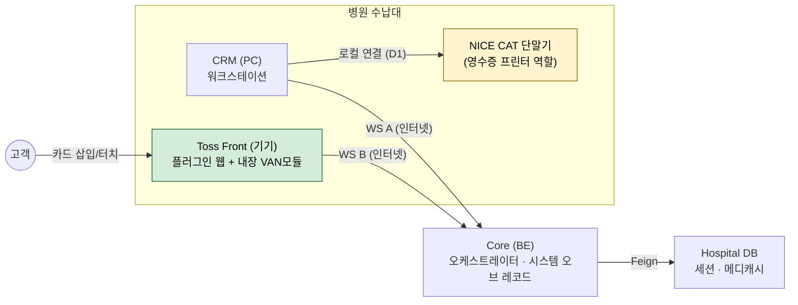

# Toss Front — Client-Mode Payment Flow (Target Design)

> **Status:** DRAFT for cross-team handoff. **Pre-implementation.** Compiled 2026-07-09.
> **Decision basis:** Toss partner support confirmation (Slack `C0ANAJW463E`, 2026-07-09) + team decisions (2026-07-09, see §1.2).
> **Supersedes** the reader-mode design ([2026-05-12-nice-paired-final-flow-design.md](./superpowers/specs/2026-05-12-nice-paired-final-flow-design.md)) **for the card-payment path.** The medicash / session-orchestration halves are largely retained.
> **Owners:** Frontend / Toss Front plugin — 정재헌. CRM + Backend(Core) — (one owner).
> **Reviewed:** 14-agent review pass 2026-07-09. **Resolved 2026-07-09:** C1 (BE-mediated accepted), C3 (Toss's own VAN), C5 (SUCCESS response field set). **Remaining:** device tests T1–T3 (incl. C2, device-only per Toss) + business 정산 sign-off.

---

## 0. How to read this document

Every load-bearing claim carries a tag:

- **[CONFIRMED]** — confirmed by Toss support (Slack `C0ANAJW463E`) or Toss public docs. Safe to build on. **A [CONFIRMED] tag means the exact claim appears in the source — not an inference from it.**
- **[DECISION]** — a design choice the team made 2026-07-09. Changing it re-opens the design. Some [DECISION] items are *internal* (team resolves them; no external party needed) — these are marked "(internal)".
- **[MUST CONFIRM]** — needs a written Toss/NICE answer **before** implementation. A wrong assumption here is a handoff-breaking mistake.
- **[MUST TEST]** — needs a real-device test to settle. Not blocking for design, blocking for release.
- **[REUSE]** — already exists in the codebase / a prior spec / prior device evidence; restore or keep rather than build new.

Citation tags: `[toss-slack]` = the C0ANAJW463E thread (quoted verbatim in §2); `[docs: <url>]` = Toss public docs; `[repo: <path> §]` = a repo doc; `[code: <path>]` = plugin source; `[findings]` = a real-device/dev observation in `docs/integration/findings.md`.

---

## 1. Executive summary

### 1.1 The switch, in one paragraph

We are moving the card-payment path from **리더기 모드 (reader mode)** to **클라이언트 모드 (client mode)**. Today, the NICE CAT terminal owns the card transaction (VAN/approval), Toss firmware overlays its own 통합결제창 and auto-`setIdle`s the device, so our plugin cannot render a result screen. In client mode, **the Toss Front processes the card through a VAN module built into the Front** `[toss-slack]`, running on **Toss's own VAN** (C3 resolved 2026-07-09 — **NICE is fully out of the card/authorization path**, retained only as a receipt printer; 정산 implication in §1.5). The **Front holds the payment-flow initiative** (that the *plugin* — not firmware — owns it and renders its own result screen is an inference gated on [MUST TEST T2]). This restores the pre-May "plugin owns `requestPayment`" flow `[repo: toss-payment-flow.md §5.5 (AWAITS_PROCEED=false path), §6]` and re-enables Toss-SDK refund and recovery. Note: whether the built-in VAN module *is* the Toss SDK `sdk.payment.*` surface is an **inference** (device-verified pre-May, not stated by Toss) — see §4.3.

### 1.2 Team decisions (2026-07-09)

| # | Decision | Consequence |
|---|---|---|
| D1 | **Receipt path: CAT stays on the CRM; the CRM prints.** | The plugin does **not** use Toss's `프론트 → CAT` Print API path. After success, the CRM prints from the terminal `session.result` data. **This deviates from Toss's described flow — see [MUST TEST C2].** |
| D2 | **BE (Core) stays orchestrator + system-of-record.** WS A / WS B / medicash / persistence all retained. | The plugin's only real change is: call `sdk.payment.requestPayment` itself instead of serial-bridging to NICE. Smallest change, maximum reuse of shipped code. |
| D3 | **Scope: full 메디캐시 (partial + 100%) + card.** | The medicash selection UI, `session.chargeContext`, and the 100%-메디캐시 skip path all carry over. |

### 1.3 What this buys us

- **Plugin-owned result screen** for card payments — the original goal. Enabled by client mode (the plugin, not firmware, renders the result). `[docs: payment.html]`, gated on `[MUST TEST T2]`. (The *receipt* is a separate, CRM-side deliverable — see D1 / [MUST TEST C2] / [MUST TEST T1] — not the same thing as the on-screen result.)
- **Refund via Toss SDK** (`requestPaymentCancel`) comes back — no longer out-of-scope. `[REUSE: toss-payment-flow.md §10]` + device-verified pre-May `[findings: real-card refund, approval 06903313, 2026-04-30]`.
- **Recovery via Toss SDK** comes back: `getPayment` device-local lookup `[REUSE: toss-payment-flow.md §9]` (unverified on device — `[MUST TEST T3]`) plus the plugin-side `pendingPayment` write `[REUSE: code history — see §8]`.

### 1.4 Top risks (full register in §11)

**✅ Resolved 2026-07-09:** **C1** — BE-mediated dispatch (CRM→BE→Plugin) **is accepted**; we keep the CRM→Backend→Toss Front structure (WS A→WS B), no direct CRM↔Front link. **C3** — authorization runs on **Toss's own VAN** (NICE fully displaced from the card path → card 정산 moves to Toss; see §1.5). **C5** — the `requestPayment` SUCCESS response carries the full card field set (§6.1); BE just relays it.

**Still open:**
1. **[MUST TEST C2]** D1's CRM-driven printing is **not** Toss's `프론트 → CAT` Print-API path. **Toss confirmed this can only be verified by a device test** (no written answer) — verify together with T1.
2. **[MUST TEST T1]** Whether the NICE CAT can act as a receipt printer at all — **Toss explicitly will not vouch for this** `[toss-slack]`.
3. **[MUST TEST T2]** Whether a plugin-initiated `requestPayment` still flashes a transient firmware payment UI and/or auto-`setIdle`s before returning control.
4. **[MUST TEST T3]** Whether device-local `getPayment` recovery actually works in the CAT-paired client-mode config (never exercised on a real device — the only passing reconcile test was a mock). See §6.4.
5. **[MUST TEST / open]** How a hard card **decline** (not user-cancel/timeout) surfaces — Toss documents only `SUCCESS`/`CANCELED`/`TIMEOUT` result types (**no `FAILED`**); confirm on device (ties to T2). See §6.5.
6. **[business]** Confirm the 정산/contract side accepts Toss-side acquiring (C3 consequence — §1.5).

### 1.5 Business implication of C3 (Toss's own VAN)

Because authorization now runs on **Toss's own VAN** (not NICE), card 정산/settlement moves from the NICE VAN사 relationship to Toss. NICE hardware is retained **only** as a receipt printer (D1). This matches the team's stated position that there is no technical lock-in to NICE `[toss-slack: "왜 나이스 단말기" thread, 2026-07-09]`. **Confirm the business/contract side accepts Toss-side acquiring before implementation.** ("TID 변경 불필요" from Toss refers to the Toss Front's own already-provisioned **Toss** TID — not a NICE TID being reused.)

---

## 2. Toss's confirmation (verbatim — the anchor)

From Slack `C0ANAJW463E` (Toss, 2026-07-09), answering "리더기 모드 → 클라이언트 모드 전환" questions. **The block below is the literal Slack message text.**

**Q (ours):** 리더기 모드에서 `CRM(PC) ↔ CAT 단말기 ↔ 토스 프론트` 구조인데, 클라이언트 모드 전환 시 연결/VAN 설정(TID, 멀티패드)을 바꿔야 하나? 영수증 자동 출력 가능한가?

**A (Toss) — verbatim:**
> 1. 통신구조 변경이 필요합니다.
>    a. 클라이언트 모드 flow로, CRM(PC) <-> 토스 프론트 사이 통신이 필요할 것 같습니다.
>       i. 현재 CAT <-> 토스 프론트 연결이 아닌 CRM과 연결해주셔야 합니다. (시리얼 or 웹소켓)
>    b. TID, 멀티패드 설정 등 VAN설정은 변경할 필요는 없습니다.
> 2. CAT 단말기를 영수증 프린터로 사용하는 구조에서 가능합니다.
>    a. 다만 CAT 단말기가 프린터로 동작 가능한지 여부에 대해서는 저희가 안내드리기 어렵습니다.
>    b. 대략적인 flow:
>       i. CRM -> 프론트 : 결제요청 — 프론트 결제API 호출 → 프론트가 결제 흐름 주도권.
>       ii. 프론트 : VAN결제처리 — 프론트에 내장된 VAN결제모듈을 통해 결제처리, 결제완료 시 Print API 호출.
>       iii. 프론트 -> CAT : 영수증 출력요청

**Reading:** the card is processed by a **VAN 결제모듈 embedded in the Front** running on **Toss's own VAN** (C3 resolved — NICE is not the acquiring VAN사; §1.5); the **Front owns the payment flow** (프론트가 결제 흐름 주도권 — whether the *plugin*, not firmware, owns it is [MUST TEST T2]); VAN settings (TID/멀티패드) **don't change** (= the Toss Front's own already-provisioned Toss TID); the CAT is used as a **printer**, but Toss won't guarantee the NICE CAT can act as one. Toss also mentioned a CRM↔Front **communication-structure change** (requirement #1) — but the team confirmed a **BE-relayed** trigger (CRM→BE→Front) is accepted (C1 resolved), so no direct link is built.

> ⚠️ **Deliberate gap to Toss's described flow (still open):** Toss line 2.b.iii is `프론트 → CAT` (the Front prints directly); team decision **D1** is `CRM → CAT` (the CRM prints). → [MUST TEST C2].
>
> ✅ **Resolved:** Toss requirement #1a (direct `CRM ↔ Front` link) — the team confirmed a **BE-relayed** trigger (CRM→BE→Front) is accepted; no direct link is built (C1).

---

## 3. Architecture — reader mode (now) vs client mode (target)

### 3.1 Comparison

| | 리더기 모드 (current) | 클라이언트 모드 (target) |
|---|---|---|
| Who processes the card | **NICE CAT terminal** (its VAN) | **VAN 결제모듈 built into the Toss Front**, on **Toss's own VAN** `[toss-slack]` (C3 resolved; NICE not the acquirer — §1.5) |
| Payment-flow initiative | Toss firmware | **Front (device)** `[toss-slack]`; that the *plugin* (not firmware) owns it is an inference gated on [MUST TEST T2] |
| Plugin result screen (card) | ❌ firmware 통합결제창 overlay + auto-`setIdle` | ✅ plugin renders it — SUCCESS via `renderResultPage` (`status:"success"`); CANCELED/TIMEOUT via `renderOrderResultPage` (`type:"cancelled"`, itemized); hard error via `renderResultPage` (`status:"error"`) — gated on [MUST TEST T2] |
| NICE CAT terminal role | card processor (owns VAN/approval/receipt) | **receipt printer, connected to CRM** (D1) |
| Card↔Front serial bridge (`sdk.serial`+`sdk.van.write`) | present `[code: config.js]` | **removed** — NICE no longer processes cards; C1 resolved → no direct CRM↔Front serial link needed |
| `sdk.payment.requestPayment` | absent (removed in May) | **restored** `[REUSE]` |
| Refund / recovery | out of scope (CRM↔NICE) | **Toss SDK** (`requestPaymentCancel` `[REUSE]`; `getPayment` `[REUSE]`+`[MUST TEST T3]`) |
| VAN 설정 (TID, 멀티패드) | — | **unchanged** `[toss-slack]` |
| Orchestrator / system-of-record | BE (Core) | **BE (Core)** — unchanged (D2) |

### 3.2 Target topology



- **Removed** from reader mode: the `CAT ↔ Toss Front` serial link (NICE no longer processes cards).
- **CAT** now hangs off the **CRM** as a printer (D1).
- BE stays the hub for both WS A and WS B (D2). **The team confirmed a BE-relayed `session.dispatch` (CRM→BE→Front) is an accepted client-mode trigger (C1 resolved 2026-07-09)** — no direct CRM↔Front link is built. The §5.1 contingency is therefore **not needed** (kept for record only).

---

## 4. Roles & ownership (handoff)

### 4.1 Frontend — Toss Front plugin (정재헌)

- Restore `sdk.payment.requestPayment` on the charged amount (`charged > 0`), after `session.chargeContext`. `[REUSE]`
- Render the **card result screen**: **SUCCESS** via `sdk.template.renderResultPage` (`status:"success"`; already used on the 100%-메디캐시 path); **CANCELED/TIMEOUT** via `sdk.template.renderOrderResultPage` (`type:"cancelled"`, itemized cancel screen); **hard error** (backend error frame / `requestPayment` reject) via `sdk.template.renderResultPage` (`status:"error"`). (`renderResultPage` = `success`|`error`; `renderOrderResultPage` = `paid`|`cancelled` `[docs: template.html]`.) Neither template shows card/approval fields on-screen — those go on the CRM-printed receipt (§9). Gated on [MUST TEST T2].
- Restore the `pendingPayment` write + `getPayment` recovery. `[REUSE]` (`getPayment` on-device behavior is [MUST TEST T3]).
- Restore `requestPaymentCancel` for refund dispatch. `[REUSE]`
- Route the card path (`charged > 0`) to `payment.html` so `requestPayment` is reached — see §8.
- **Remove** the reader-mode serial bridge (`sdk.serial.open`, `sdk.van.write`, `sdk.serial.listen/close`, `initSerialPort`). `[code: config.js, order.html, home.html]` (C1 resolved → BE-mediated trigger; no CRM↔Front serial link to preserve.)
- Keep the 메디캐시 selection UI + `session.chargeContext` + the Template-API 100%-메디캐시 success screen.
- Do **not** print to the CAT (D1: printing is the CRM's job).

### 4.2 CRM + Backend / Core (one owner)

- **BE:** keep session orchestration, state machine, medicash deduction (`RCPT_INFO.DC_AMT`), `tossResponse` persistence, error frames — all unchanged from `[repo: toss-payment-flow.md]`.
- **BE:** **revert** the reader-mode WS A additions — the `session.result (CRM→BE, niceResponse)` intake **and** the BE→CRM `session.chargeContext` forward (the "so CRM dispatches to NICE" instruction). The card result now comes from the **plugin** again (`Plugin→BE session.result` with `tossResponse`).
- **BE:** carry forward the NICE-paired **medicash-deduction-failure softening** (persist SUCCEEDED, echo to CRM, retry deduction async) — do **not** restore the legacy suppress-echo rule. See §9. **Load-bearing** because in client mode the card is already charged by the time BE deducts.
- **CRM:** on the terminal `session.result (SUCCEEDED)` echo, **print the receipt on the locally-connected CAT** using `tossResponse` + amount breakdown (D1). This is the one genuinely new CRM responsibility. Receipt-write must be **idempotent** (write once, at SUCCEEDED — a late reconcile can produce a second `session.result`, see §6.4 / `[findings]`). `[MUST TEST C2]`, `[MUST TEST T1]` (C5 resolved — BE relays the full `response.card`; §6.1)
- **CRM:** stop dispatching card payments to NICE (NICE no longer processes cards).

### 4.3 Toss Front firmware / SDK (Toss)

- The Front exposes a payment surface that routes to the built-in VAN module. **Inference:** this surface is `sdk.payment.requestPayment` / `getPayment` / `requestPaymentCancel`. Toss's Slack answer named only "프론트 결제API 호출" and "프론트에 내장된 VAN결제모듈" — it did **not** name any SDK method. The identity with `sdk.payment.*` is our inference, **device-verified pre-May** (real-card payment + refund, approval `06903313` van `KIS`, 2026-04-30; mixed-medicash payment + refund, approval `77799441`, 2026-05-04). `[REUSE]` `[findings]` — **not** `[CONFIRMED]`. (C3's resolution — Toss's own VAN — is consistent with this surface being `sdk.payment.*`, since that SDK drives Toss acquiring; still verify method-for-method on device via T2/T3.)
- Returns the result to the plugin (`SUCCESS`/`CANCELED`/`TIMEOUT`); the plugin — not firmware — is expected to render the result. `[docs: payment.html]`, `[MUST TEST T2]` (reader mode had firmware overlay + auto-`setIdle`; verify client mode does not).

### 4.4 NICE CAT terminal

- **No longer processes cards.** Repurposed as a receipt printer on the CRM (D1). Whether it can do this is [MUST TEST T1].

---

## 5. Connection & transport

| Channel | Endpoint | Status |
|---|---|---|
| **WS A** — CRM ↔ Core | `wss://<core>/ws/crm?token=<workstationToken>` | Retained `[REUSE]` |
| **WS B** — Plugin ↔ Core | `wss://<core>/ws/plugin?serial=<serial>&token=<coreToken>` | Retained `[REUSE]` |
| **CRM ↔ CAT** | local (USB/serial, CRM-owned) | **New role** — printer only (D1) |
| ~~CAT ↔ Front~~ | ~~serial~~ | **Removed** |

dev core host: `develop.api.core.smartdoctor.systems` · release: `release.api.core.smartdoctor.systems`.

**✅ C1 — RESOLVED (2026-07-09).** Although Toss's Slack answer mentioned a direct `CRM ↔ 토스 프론트` link, the team confirmed that the existing **BE-mediated** trigger (CRM → Backend → Toss Front, over WS A + WS B) is an **accepted** client-mode structure. **No direct CRM↔Front link is built**; the payment trigger stays on the existing WS A→WS B path. The §5.1 contingency below is retained for record only — it is **not** being executed.

### 5.1 Contingency — NOT NEEDED (C1 resolved to BE-mediated)

> C1 resolved: BE-mediation is accepted, so this contingency is **not being executed**. Kept for record only, in case Toss later mandates a direct link.

If a direct CRM↔Front link were ever required: **Frontend** stands up a local link to the CRM (an `sdk.webSocket` **server** — `sdk.webSocket` is a server namespace `[code: home.html:71]` — or a CRM-facing `sdk.serial` link); **CRM** implements the matching local client; **BE**'s trigger role shrinks to system-of-record (still owns state, persistence, medicash, terminal echo).

---

## 6. End-to-end flows

### 6.1 Card + partial 메디캐시 (or no 메디캐시) — happy path

```
CRM  → BE     session.create                                  [WS A]
BE   → Hosp   POST /internal/toss-payment/sessions (CREATED)
BE   → CRM    session.ack (CREATED, sessionId)
BE   → Plugin session.dispatch (kind=payment, sessionId, paymentKey, amount,
                orderSnapshot, pointContext, timeoutMs, excludePaymentTypes)  [WS B → home.html → order.html]
BE   → CRM    session.status (DISPATCHED)

Plugin → BE   session.claim                                   [order.html]
BE   → CRM    session.status (IN_PROGRESS)

[order.html renders 메디캐시 selection UI]
[customer picks amount, taps 결제]

Plugin → BE   session.chargeContext (pointUseAmount, chargedSupplyValue, chargedTax)
BE   → Hosp   PATCH .../charge-context
[charged > 0 → order.html navigates to payment.html#sessionId]     ★ card path handoff

★ CLIENT-MODE CHANGE — plugin (payment.html) calls Toss payment itself (charged > 0):
Plugin        sdk.payment.requestPayment({ paymentKey: sessionId,
                supplyValue: chargedSupplyValue, tax: chargedTax, tip: 0,
                excludePaymentTypes: ['CASH'] })
[Front built-in VAN module processes the card]                [toss-slack]
Plugin        result = { type: 'SUCCESS', response: {...card...} }
Plugin        renderResultPage (card branch)                  ★ our own result screen [MUST TEST T2]

Plugin → BE   session.result (pointUseAmount, chargedSupplyValue, chargedTax,
                tossResponse = SUCCESS {...})
BE   → Hosp   PATCH .../result (SUCCEEDED; deduct 메디캐시 via RCPT_INFO.DC_AMT if pointUseAmount>0)
BE   → CRM    session.result (SUCCEEDED, tossResponse, pointUseAmount, charged*, amount)  [terminal echo]

★ D1 — CRM prints receipt:
CRM           print receipt on locally-connected CAT using tossResponse + breakdown
              [MUST TEST C2][MUST TEST T1]  (C5 resolved — §6.1)

[Plugin returns to home.html via location.href — NOT sdk.app.setIdle() (blank-screen bug)]  [MUST TEST T2]
```

**Receipt-data note (C5 — resolved via docs 2026-07-09).** The `requestPayment` SUCCESS response exposes a full card field set under `response.card` `[docs: payment.html]`:

```
response.card = {
  van,             // VAN사 코드
  timestamp,       // 승인 시각
  approvalNumber,  // 승인번호
  acquirerName, acquirerCode,   // 매입사
  issuerName, issuerCode,       // 발급사
  cardType,        // 카드 종류
  installment,     // 할부 개월
  maskedCardNumber,// 마스킹 카드번호 (bin 8자리)
  balance          // 선불카드 잔액
}
```

`getPayment` returns the **identical** structure `[docs: payment.html]`. This covers approval no., masked PAN, timestamp, issuer, acquirer, installment, and VAN사 — enough for the card portion of a 매출전표. The 메디캐시/amount breakdown comes from `pointUseAmount`/`chargedSupplyValue`/`chargedTax` on the same `session.result`. **Remaining action:** BE must relay the **full `response.card`** on the BE→CRM echo (the legacy §6 example redacted it to `{}` / `{timestamp, approvalNumber}` — that was illustrative, not a field limit; the real-device happy path forwarded the full object, approval `30021105` `[findings: Happy Path]`). Formal-slip validity (business number, whether a CAT-printed slip is a legal 매출전표) is a print-side item folded into [MUST TEST C2] (owner: CRM-BE, + tax if a formal slip is required).

> **No `session.proceed`.** The reader-mode / NICE-relay waiting dance (`[repo: toss-payment-flow.md §5.5]`, `AWAITS_PROCEED`) does **not** exist here. The plugin calls `requestPayment` immediately after `chargeContext`. This is the `AWAITS_PROCEED=false` legacy path `[repo: toss-payment-flow.md §5.5]`.

### 6.2 100% 메디캐시 (no card) — unchanged

```
[... through session.claim + 메디캐시 selection ...]
[charged === 0 → order.html navigates to payment.html#sessionId]
Plugin → BE   session.chargeContext (chargedSupplyValue=0, chargedTax=0, pointUseAmount=total)
BE   → Hosp   PATCH .../charge-context

Plugin → BE   session.result (tossResponse = null)            [no requestPayment call]
BE   → Hosp   PATCH .../result (SUCCEEDED; deduct 메디캐시)
BE   → CRM    session.result (SUCCEEDED, tossResponse=null)

[Plugin renders its own 수납 완료 screen (Template API) → location.href = home.html]
[CRM: no card receipt; print 메디캐시-only receipt if required]
```

Detection rule (unchanged): `chargedSupplyValue + chargedTax === 0` → skip card. `[REUSE: toss-payment-flow.md §5]`

### 6.3 Refund / cancel — restored via Toss SDK

```
CRM  → BE     refund.create (originalSessionId)                [WS A]
BE            validate SUCCEEDED + has Toss payment + no active refund
BE   → Plugin session.dispatch (kind=cancel, cancelParams from persisted tossResponse)  [WS B]
Plugin        sdk.payment.requestPaymentCancel(cancelParams)   ← restored
Plugin → BE   refund.result (tossResponse)
BE   → CRM    refund.result (SUCCEEDED)
CRM           print cancel receipt on CAT (D1) if required     [MUST TEST C2][MUST TEST T1]
```

`[REUSE: toss-payment-flow.md §10]` + device-verified pre-May `[findings]`. **C3 resolved (Toss's own VAN)** means the card runs entirely on Toss's payment surface, so `requestPaymentCancel` operates on a Toss approval end-to-end — refund is unambiguous (still verify method-for-method on device via T2/T3). The SUCCESS `response.card` carries the `approvalNumber` + `timestamp` the cancel needs `[docs: payment.html]`.

**Caveats:**
- **100%-메디캐시 sessions** have no Toss approval, so SDK cancel does not apply — medicash reversal remains a separate BE/policy path. `[repo: §10]`
- **Partial-메디캐시 sessions (card + points):** `requestPaymentCancel` reverses **only the card charge**. The used points (deducted into `RCPT_INFO.DC_AMT` on success, §6.1) are **not** restored by the SDK cancel. BE/policy must **also** reverse the `RCPT_INFO.DC_AMT` deduction. [MUST CONFIRM] (owner: CRM-BE) — do not ship a refund that strips the customer's used 메디캐시.
- **Refund itself can fail** (e.g. `requestPaymentCancel` returns `FAILED` / `DEVICE_OFFLINE`, observed on device when the plugin blanked and dropped WS — succeeded after reboot `[findings: Real-card device test]`). Refund stays non-terminal / retriable; see §10. This is a live risk because client mode keeps the `location.href` (not `setIdle`) lifecycle to avoid the blank-screen bug.

### 6.4 Recovery (crash / reload) — restored, card-path only

```
Plugin (re)mount → device.register → BE detects in-flight session → session.reconcile   [WS B]
Plugin        sdk.payment.getPayment({ paymentKey: sessionId })  ← restored (device-local cache)
Plugin → BE   session.result (late: true, pointUseAmount, chargedSupplyValue, chargedTax, tossResponse)
BE   → CRM    session.result (SUCCEEDED, late: true)
```

`[REUSE: toss-payment-flow.md §9]`. **Expected to work** because the Front processed the card itself, so `getPayment` (device-local) can see it — in reader mode this was impossible. **Not yet verified on a real device** (the only passing reconcile test was a mock that fakes a SUCCESS reply, `[findings: Reconcile]`); `getPayment` also caches SUCCESS results only. → [MUST TEST T3].

**Scope limit:** this recovery applies to the **card path only**. A **100%-메디캐시** session that crashes *after* `session.chargeContext` but *before* `session.result` has **no Toss payment for `getPayment` to find** — it cannot be recovered this way and **EXPIRES** (no recovery), matching the superseded design's narrow-window carve-out `[repo: 2026-05-12 §6]`.

**Idempotency:** the reconcile path can deliver a second `session.result` for a sessionId the CRM already saw as EXPIRED (then late-SUCCEEDED) `[findings: Reconcile]`. The `pendingPayment` (plugin-pull) path and the BE `session.reconcile` (BE-push) path can each emit a late result. CRM receipt-write must be **idempotent** — write once, at SUCCEEDED, regardless of order or which path fired.

---

### 6.5 Card declined / canceled / timeout (Plugin→BE failure envelope)

Toss documents **only three** `requestPayment` result types — `SUCCESS` / `CANCELED` / `TIMEOUT` (there is **no** `FAILED` type) `[docs: payment.html]`. The legacy spec shows only the SUCCESS and 100%-메디캐시-`null` envelopes, so the non-success envelope must be defined here. On a non-success `requestPayment`:

```json
{
  "type": "session.result",
  "payload": {
    "sessionId": "{sessionId}",
    "pointUseAmount": 0,
    "chargedSupplyValue": 26364,
    "chargedTax": 2636,
    "tossResponse": { "type": "CANCELED" | "TIMEOUT", "response": { "reason": "..." } }
  }
}
```

Mapping (BE assigns terminal state + `failureReason` on the BE→CRM echo):

| Plugin `tossResponse.type` | Session STATUS | `failureReason` |
|---|---|---|
| `CANCELED` (user canceled / card declined?) | `CANCELED` | `USER_CANCELED` |
| `TIMEOUT` | `EXPIRED` | `EXPIRED` |
| ~~`FAILED`, `response.reason === "USER_BACKED_OUT"`~~ — **RETIRED 2026-07-22.** Its only producer was the plugin 할부 screen's back-arrow; with that screen removed (§6.6) no plugin-owned screen sits between `chargeContext` and `requestPayment`, so the payment page never emits this. `order.html`'s `session.abort(USER_BACKED_OUT)` on the 메디캐시 page is a **different** message at a **different** stage and is unaffected. | ~~`CANCELED`~~ | ~~`USER_CANCELED`~~ |
| `FAILED`, any other reason (hard decline / insufficient funds / `requestPayment` reject) | `CANCELED` (or new `FAILED`) | `PAYMENT_DECLINED` (carry `reason` through) |

- **⚠️ Hard-decline representation is undocumented.** Toss lists no `FAILED` type, so a VAN reject / insufficient-funds decline likely surfaces as `CANCELED` (or a rejected Promise). **Confirm on device** which — ties to [MUST TEST T2]. The plugin must wrap `requestPayment` in `try/catch` in case a hard failure **rejects** rather than resolves.
- **No medicash deduction** on any non-success (`RCPT_INFO.DC_AMT` untouched).
- **Same-session retry (2026-07-13):** on a non-success attempt the plugin sends **nothing terminal** and renders the itemized failure screen (`renderOrderResultPage type:"cancelled"`, cta `다시 결제하기`). The session stays `IN_PROGRESS`; `[다시 결제하기]` re-calls `requestPayment` on the **same `sessionId`**. A terminal `session.result` fires only on `SUCCESS` or the back-arrow give-up — the give-up envelope forwards a resolved `CANCELED`/`TIMEOUT` **unchanged** (mapping per the table above); `FAILED` is synthesized only for the reject path (no result object). An abandoned failure screen resolves via `EXPIRED`. Give-up after a *rejected* attempt reconciles via `getPayment` first (a real charge is reported `SUCCESS`, never overwritten with `FAILED`). **Depends on:** paymentKey-reuse [MUST TEST], `getPayment` on-device [MUST TEST T3], `renderOrderResultPage.onBack` [GAP], and BE handling `FAILED`→late-`SUCCESS` (§6.4 idempotency). Supersedes the prior "retry requires a fresh CRM session.create."
- **CRM prints no card receipt** on non-success.

### 6.6 할부 (installment) selection — firmware-owned (corrected 2026-07-22)

**Correction.** The 2026-07-13 entry here recorded that the client-mode firmware payment UI does **not** prompt for 할부, and the plugin grew its own `sdk.template.renderSelectPage` 개월수 screen on that basis. **That finding was wrong.** Device observation 2026-07-22: the firmware prompts on the **서명 (signature)** screen — a `할부 … 일시불 >` row that opens the module's own 개월수 picker — and the row appears automatically once the charged amount exceeds 50,000원. The plugin screen asked the same question one screen earlier and the firmware asked again regardless, so it has been **removed**. `payment.html` now calls `requestPayment` with **no `installment` param** (SDK default `0`) and the module owns selection end to end.

Consequences of the removal:

- The plugin no longer has any screen between `chargeContext` and `requestPayment`. The `FAILED`/`USER_BACKED_OUT` envelope had no other producer and is **retired** (§6.5).
- Retry (`다시 결제하기`) goes straight back to `requestPayment`; the firmware re-prompts for 할부 on each fresh call, so switching to installments remains the natural remedy for a 한도 초과 decline.

Unchanged obligations — firmware-owned selection makes non-zero `response.card.installment` values **more** likely, not less:

- 무이자: no SDK param exists (confirmed 2026-07-13); the issuer/merchant contract decides at authorization.
- **[BE, MUST DO]** `cancelParams.installment` = persisted `response.card.installment` ("원본 결제의 할부 개월") — else refunds of installment payments go out as 일시불. VAN behavior on mismatch undocumented → device-test.
- **[CRM]** `HALBU`/`InstallmentPayMonth` ← `response.card.installment`.
- **[BE]** C4 `IN_PROGRESS`→`EXPIRED` watchdog: 할부 dwell is now **inside** the firmware's own `timeoutMs` window rather than separate pre-attempt plugin think-time. Failure-screen dwell and N retries still apply.
- **[MUST TEST]** (1) omitting `installment` still shows the firmware 할부 row at ≥5만원 and not below; (2) a 3개월 selection echoes back as `response.card.installment === 3`; (3) installment approval end-to-end; (4) cancel of an installment approval with vs. without `cancelParams.installment`; (5) overlay transition (blank-WebView family).

---

## 7. Wire-contract delta vs. reader mode

**Reverts (back to the pre-May / legacy shape `[repo: toss-payment-flow.md]`):**
- `session.result` is again **Plugin→BE** carrying `tossResponse` (SUCCESS/…). The reader-mode **CRM→BE `session.result` with `niceResponse`** direction is **removed**.
- The reader-mode **BE→CRM `session.chargeContext` forward** is **removed** (CRM no longer needs it — it no longer dispatches to NICE) `[repo: 2026-05-12 §4.2]`.
- **`session.dispatch` payment envelope reverts to the legacy shape:** reader mode dropped `kind`, `paymentKey`, `timeoutMs`, `excludePaymentTypes` `[repo: 2026-05-12 §4.3]` `[code: payment.html:45]`; client mode **re-adds all four** per legacy §3 (`kind` for the payment/cancel discriminator, `paymentKey` + `excludePaymentTypes` for `requestPayment`, `timeoutMs` for the §10 EXPIRED timer). `home.html`'s dispatch handler must restore a `kind`-based branch (payment → order.html; cancel → refund).
- Refund flows through the plugin again (`session.dispatch(kind=cancel)` → `requestPaymentCancel`). Reader-mode "refund out of scope" is reversed.
- `session.reconcile` + `getPayment` recovery **restored** (`getPayment` on-device = [MUST TEST T3]).

**Kept from current design:**
- `device.register` / `device.registered`, `session.create` / `session.ack`, `session.claim`, `session.status` (DISPATCHED/IN_PROGRESS), `session.chargeContext` (Plugin→BE), `session.abort` (both directions), `error` frames. `[REUSE]`
- Session state machine `CREATED→DISPATCHED→IN_PROGRESS→{SUCCEEDED|FAILED|CANCELED|EXPIRED}`.
- Medicash: `pointContext` enrichment, `chargeContext` validation (`pointUseAmount + charged* + tip == total`), `RCPT_INFO.DC_AMT` deduction.

**New:**
- CRM prints the receipt on its CAT after the terminal `session.result` (D1). `[MUST TEST C2]`

**Not used (from the abandoned NICE-relay experiment):**
- `session.proceed` / `AWAITS_PROCEED` / waiting screen — never needed here.

---

## 8. Frontend (plugin) implementation delta

> Reference the pre-May code these paths were removed from — the git history for `payment.html` (`sdk.payment.requestPayment`) and `config.js` (`runPendingPaymentRecovery`, `PENDING_KEY`) has the exact prior implementation. `[REUSE]`

**Restore:**
- [`payment.html`] `sdk.payment.requestPayment` on the charged amount when `charged > 0`; branch on `result.type` (SUCCESS vs CANCELED/TIMEOUT — **no `FAILED` type**; also wrap in `try/catch` for a hard reject — see §6.5).
- [`payment.html`] a **card result branch**: **SUCCESS** → `sdk.template.renderResultPage` (`status:"success"`); **CANCELED/TIMEOUT** → `sdk.template.renderOrderResultPage` (`type:"cancelled"`, itemized); **hard error** → `sdk.template.renderResultPage` (`status:"error"`, via `renderBackendErrorPage`). (`renderResultPage`=`success`|`error`; `renderOrderResultPage`=`paid`|`cancelled` `[docs: template.html]`.)
- [`payment.html`] `pendingPayment` write to `sdk.storage` immediately before `requestPayment`.
- [`payment.html`] `runCancel` → `sdk.payment.requestPaymentCancel` for `session.dispatch(kind=cancel)`.
- [`home.html`] restore a `kind`-based branch in the `session.dispatch` handler (payment → `order.html`; cancel → refund path); `session.reconcile` handler; `runPendingPaymentRecovery` on `ws.onopen`; `getPayment` lookup.

**Route the card path to `payment.html`:**
- [`order.html`] Currently the `charged === 0` branch navigates to `payment.html` and the `charged > 0` branch calls `enterReaderMode()` and stays on the device (`order.html:239-251`). **Change:** the `charged > 0` branch must `location.href = './payment.html#' + sessionId` too. Drop the `charged === 0` special-case; `payment.html` runs `requestPayment` for the card path and sends `tossResponse: null` for the 100%-메디캐시 path, branching internally on `charged`.

**Remove (reader-mode bridge):**
- [`config.js`] `sdk.serial.open` / `sdk.van.write` / `sdk.serial.listen` / `sdk.serial.close`; the `initSerialPort` function. *(pending C1 — see §5.1: if a direct CRM↔Front serial link is required, repurpose rather than delete.)*
- [`home.html`] remove **only** the `initSerialPort()` call (`home.html:41`). **Keep** the boot idle screen `sdk.template.renderIdlePage({type:'default'})` at `home.html:36` — it is the legitimate idle dispatcher screen, not a reader-mode artifact.
- [`order.html`] remove `enterReaderMode()` (definition + call, `order.html:251-267`, which itself calls `renderIdlePage`) and the `initSerialPort()` call (`order.html:52`).

**Keep:**
- [`order.html`] 메디캐시 selection UI + `session.chargeContext`.
- [`payment.html`] 100%-메디캐시 `session.result (tossResponse: null)` + the **Template-API** 수납 완료 screen (`sdk.template.renderResultPage`, `payment.html:86-103` — already Template-API compliant; **not** custom innerHTML).
- Lifecycle: return to `home.html` via `location.href`, **not** `sdk.app.setIdle()` (blank-screen bug). `[repo: findings.md]`

**Verify on device:** [MUST TEST T2] whether a plugin-initiated `requestPayment` flashes a firmware payment UI / auto-`setIdle`s before the Promise resolves; [MUST TEST T3] whether `getPayment` device-local recovery works.

---

## 9. CRM + Backend implementation delta

**BE (Core):**
- **Revert** reader-mode WS A additions: remove the `session.result (CRM→BE, niceResponse)` intake **and** the BE→CRM `session.chargeContext` forward (the "so CRM dispatches to NICE" behavior). Card result again arrives `Plugin→BE`.
- **Restore** the legacy result/refund/reconcile handling (`§6`, `§9`, `§10` of `toss-payment-flow.md`) — **with one deliberate exception below.**
- **Do NOT restore** the legacy §6 rule "if 메디캐시 deduction fails, do not forward success to CRM." In client mode the card is **already charged** by the Front's VAN before BE runs the `RCPT_INFO.DC_AMT` deduction, so suppressing the echo would produce an orphan charge (real money moved, no CRM receipt, no operator signal). **Instead, carry forward the NICE-paired softening** `[repo: 2026-05-12 §6]`: persist SUCCEEDED once the card charge succeeds even if the deduction fails, echo SUCCEEDED to CRM (so the receipt prints), retry the deduction asynchronously with backoff, and emit a `MEDICASH_DEDUCT_PENDING`-style `error` frame for operator follow-up.
- Keep medicash deduction, persistence, error frames, timeouts.
- **Re-add `timeoutMs` to the `session.dispatch` payload** (reader mode dropped it) — the §10 EXPIRED timer (`timeoutMs + 30s`) depends on it. Decide whether `excludePaymentTypes` is dispatched by BE or hardcoded plugin-side (legacy dispatched it).
- **Timeout note (C4, internal):** the extended reader-mode `IN_PROGRESS` timer (≥180s for NICE fumbling) can revert toward the SDK-bounded `timeoutMs + 30s`, since the Front now controls the card UI directly. Confirm the value internally.

**CRM:**
- **Stop** dispatching card payments to NICE.
- **Add** receipt printing: on terminal `session.result (SUCCEEDED)`, print on the locally-connected CAT using `tossResponse` + `pointUseAmount`/`chargedSupplyValue`/`chargedTax`. The printable card field set is the full `response.card` (van/approvalNumber/timestamp/acquirer/issuer/cardType/installment/maskedCardNumber) relayed by BE (§6.1, C5 resolved); formal-slip validity (business no., legal 매출전표) folds into `[MUST TEST C2]`. `[MUST TEST T1]`
- **Idempotent receipt-write:** write the receipt once, at SUCCEEDED. A late reconcile can deliver a second `session.result` for the same sessionId `[findings: Reconcile]`.
- **[MUST CONFIRM — receipt card number]** In client mode the printable card number is **Toss's `maskedCardNumber` only** — Toss's VAN never returns the full PAN, and the NICE CAT (printer-only) no longer sees the card. Reader-mode slips printed NICE's own mask format, so the number *looks different* now ("이상하게 들어감", device feedback 2026-07-13). Masked PAN on a 매출전표 is standard/PCI-required; if the *format* is wrong, normalization of `maskedCardNumber` is **CRM-side**. Owner: CRM (+ business sign-off that Toss's mask format is acceptable).
- Keep `session.create` / `session.abort` / observing `session.status` / booking off the terminal echo.

---

## 10. Edge cases

| Case | Behavior | Source |
|---|---|---|
| Plugin offline at create | 10s grace → `FAILED / DEVICE_OFFLINE` | `[REUSE §3]` |
| Dispatched, no claim in 30s | `FAILED / PLUGIN_UNRESPONSIVE` | `[REUSE §9]` |
| `IN_PROGRESS`, no result | `EXPIRED` after `timeoutMs + 30s` (see §9 timeout note; needs `timeoutMs` re-added to dispatch) | `[REUSE §9]` |
| Card declined / `requestPayment` `CANCELED`/`TIMEOUT`/reject | plugin renders the itemized failure screen (`renderOrderResultPage type:"cancelled"`, cta `다시 결제하기`) and sends **nothing terminal** — session stays `IN_PROGRESS` for same-session retry; terminal `session.result` only on `SUCCESS` or give-up (envelope per §6.5); **no** medicash deduction on non-success | §6.5, §6.6 |
| CRM abort in CREATED/DISPATCHED | `session.abort` → CANCELED (plugin navigates home if dispatched) | `[REUSE §7]` |
| User backs out during 메디캐시 UI (pre-chargeContext) | `session.abort (USER_BACKED_OUT)` → CANCELED | `[REUSE §8]` |
| Abort **during** `requestPayment` (card entry) | firmware payment UI owns the moment; abort via `requestPayment` cancel/timeout semantics, not a WS abort | `[MUST TEST T2]` |
| 100% 메디캐시 | no card, no CAT print of a card receipt; `tossResponse: null` | §6.2 |
| Crash mid-payment (card path) | `getPayment` recovery (§6.4) | `[REUSE §9]` `[MUST TEST T3]` |
| Crash after chargeContext, before result (**100% 메디캐시**) | no card to recover → `EXPIRED`, no recovery | §6.4 |
| Refund fails (`requestPaymentCancel` → `FAILED`/`DEVICE_OFFLINE`) | refund non-terminal / retriable; historically triggered by the setIdle blank-screen lifecycle bug | `[findings]` §6.3 |
| Partial-메디캐시 refund | card reverses via `requestPaymentCancel`; `RCPT_INFO.DC_AMT` points **must also** be reversed by BE/policy | §6.3 [MUST CONFIRM] |
| Receipt print fails | payment already SUCCEEDED (system-of-record intact); CRM retries/handles print out-of-band | D1 |

---

## 11. Open items — risk register (resolve before/at implementation)

| ID | Item | Type | Owner | Why it's load-bearing |
|---|---|---|---|---|
| **C1** | Is BE-mediated dispatch (CRM→BE→Plugin) acceptable "client mode"? | ✅ RESOLVED 2026-07-09 | CRM-BE | **Accepted** — keep CRM→Backend→Toss Front (WS A→WS B); no direct CRM↔Front link. §5.1 contingency not executed. |
| **C2** | Is CRM-driven printing to the CAT supported (vs Toss's `프론트→CAT` Print API)? | MUST TEST (device-only) | CRM-BE + NICE | Toss confirmed it can only be verified by device test — verify together with T1. |
| **T1** | Can the specific NICE CAT function as a (CRM-attached) receipt printer? | MUST TEST | CRM-BE + NICE | Toss explicitly won't vouch `[toss-slack]`. If not, print via Toss Front's own printer instead. |
| **C3** | Does client-mode authorization route through NICE VAN사 or Toss's own VAN? | ✅ RESOLVED 2026-07-09 | CRM-BE (+ business) | **Toss's own VAN.** NICE fully out of the card path (printer only). Card 정산 moves to Toss — **confirm business/contract accepts Toss acquiring** (§1.5). "TID 변경 불필요" = the Toss Front's own Toss TID. Refund/recovery via Toss SDK now unambiguous. |
| **T2** | Does plugin `requestPayment` flash a firmware UI / auto-`setIdle` before returning? Also: how does a **hard decline** surface (no `FAILED` type)? | MUST TEST | Frontend | Affects result-screen UX + lifecycle (blank-screen bug family). Decline may surface as `CANCELED` or a rejected Promise — §6.5. |
| **T3** | Does device-local `getPayment` recovery work in the CAT-paired client-mode config? | MUST TEST | Frontend | Never exercised on a real device (only a mock reconcile passed); `getPayment` caches SUCCESS only. §6.4. |
| **C4** | Exact `IN_PROGRESS` timeout in client mode (revert from ≥180s toward `timeoutMs + 30s`?) | DECISION (internal) | CRM-BE | Card UI is now Front-controlled; long NICE timer may no longer apply. Internal — no external party. |
| **C5** | Does the plugin `SUCCESS` response surface the full 매출전표 field set? | ✅ RESOLVED (docs) 2026-07-09 | CRM-BE | **Yes** — `response.card` carries van/approvalNumber/timestamp/acquirer/issuer/cardType/installment/maskedCardNumber `[docs: payment.html]` (§6.1). BE must relay the full object. Slip *print validity* (business no., formal 매출전표) folds into C2. |

---

## 12. Rollout & test plan

1. **C1/C3/C5 resolved (2026-07-09); C2 is device-test-only** (Toss confirmed no written answer). **No external confirmations remain pre-code.** Business: confirm Toss-side 정산 (§1.5).
2. **Device smoke (T1, T2, T3):** one unit, provision client mode; run a card payment and observe (a) `requestPayment` resolves to the plugin, (b) plugin result screen renders, (c) no premature auto-`setIdle`, (d) CRM prints on the CAT, and (e) a forced crash-then-reconnect recovers via `getPayment` (first real T3 exercise).
3. **Frontend:** restore requestPayment/result/recovery/cancel; route card path to payment.html; remove serial bridge (§8).
4. **CRM-BE:** revert reader-mode WS A relay (both directions); restore legacy result/refund/reconcile with the medicash-deduct-failure softening; re-add `timeoutMs` to dispatch; add CRM idempotent receipt print (§9).
5. **E2E matrix:** card+partial 메디캐시, 100% 메디캐시, refund (incl. partial-메디캐시 point reversal + refund-failure), decline/timeout, crash-recovery (card + 100%-메디캐시 window), abort.
6. **Verify** against the flows in §6 before sign-off.

---

## 13. References

- **Toss confirmation:** Slack `C0ANAJW463E` (2026-07-09) — quoted verbatim §2.
- **Legacy protocol (the flow being restored):** [docs/superpowers/specs/toss-payment-flow.md](./superpowers/specs/toss-payment-flow.md) — §5.5 (AWAITS_PROCEED=false path), §6 result, §9 recovery, §10 refund, §11 error frames. **Note:** that doc's top banner marks §5.5/§9/§10 as *obsolete under the NICE-paired contract*; client mode deliberately **un-supersedes** them (they were the correct pre-reader-mode contract). Read them as authoritative for client mode despite the banner.
- **Reader-mode design being superseded (card path):** [docs/superpowers/specs/2026-05-12-nice-paired-final-flow-design.md](./superpowers/specs/2026-05-12-nice-paired-final-flow-design.md) and the role MDs [frontend](./payment-flow-with-nice-terminal-frontend.md) / [crm](./payment-flow-with-nice-terminal-crm.md) / backend. The medicash-deduct-failure softening (§6) is explicitly carried forward.
- **Toss SDK:** payment.html (`requestPayment`/`requestPaymentCancel`/`getPayment`), template.html (`renderResultPage`/`renderOrderResultPage`), test/payment.html (결제 시스템 구조).
- **Plugin source:** [front-plugin-js/](../front-plugin-js/) — `home.html`, `order.html`, `payment.html`, `config.js`.
- **Device/dev evidence + known lifecycle bug:** [docs/integration/findings.md](./integration/findings.md) — real-card payment+refund (approvals `06903313`, `77799441`), reconcile mock, and the setIdle blank-screen bug.

---

_Reviewed (14-agent pass, 2026-07-09). C1/C3/C5 resolved. Remaining: device tests T1–T3 (incl. C2, device-only) + business 정산 sign-off._
